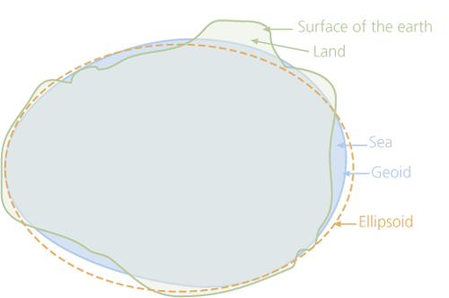
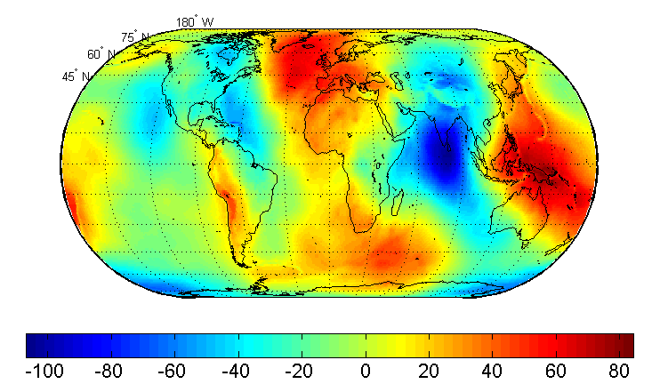
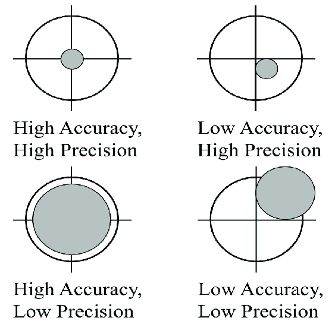
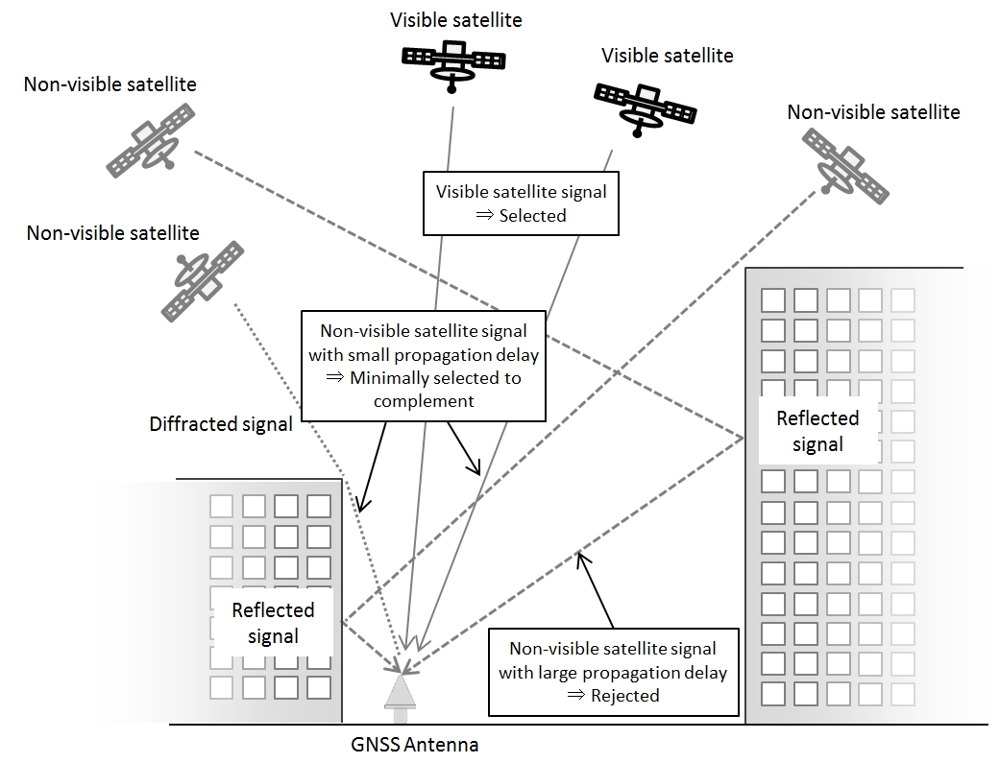
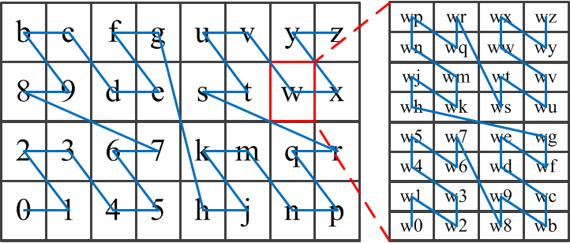

In this section we will work on single user data.
The whole analysis will be based on our personal geo-localization dataset that contains a number of geographical points.
The analysis will be based on specific ideas that can show a possible user's behaviour when "exploring" or simply moving trough a geographical area.

### Dataset

We used personal global navigation satellite system (GNSS) logging data.
The dataset is strictly personal and its disclosure is a violation of privacy protection regulation.

The basic idea of this analysis is to try to see what interesting informations could be found simply from some GNSS points recorded over time.

Our personal dataset was collected using three different mobile devices (in detail ASUS Zenfone 3, Nexus 5X, Samsung Galaxy S20 FE), using among all the open source app GPSLogger ([on github](https://github.com/mendhak/gpslogger){target="_blank"}).
The data recording started as a game challenge with some friends to know how much places we had seen and in particular how much we have moved in a timespan of a year (quantified self).

The geographic data was recorded on some comma-separated values files (.csv).
The application recorded the points when the user activated the data recording and with a frequency of 1 observation per second if the wanted accuracy (changed based on needs e.g., we were in an underground room, we used a different mean of transport, ...) was reached.
This was useful to work directly on R, without going through special libraries or functions to deal with different formats such as .gpx or .geojson files.

Every dataset observation is composed of the following variables:

-   **time**stamp in the standard format [ISO 8601](https://en.wikipedia.org/wiki/ISO_8601){target="_blank"}, e.g., *2022-06-05T11:01:37Z* in the Coordinated Universal Time (UTC);
-   **lat**itude and **lon**gitude geographic coordinates, represented in [decimal degrees](https://en.wikipedia.org/wiki/Decimal_degrees){target="_blank"};
-   **elevation** using the [WGS84](https://en.wikipedia.org/wiki/World_Geodetic_System){target="_blank"} standard, and **geoidheigh**; note that the altitude value is calculated using approximations so we will need to deal with geoid height to get more precise results;
-   **accuracy** that can be represented as the radius expressed in meters around a (lat, lon) point; this value, together with **hdop**, **vdop**, **pdop** which represent the [dilution of precision](https://en.wikipedia.org/wiki/Dilution_of_precision_(navigation)%7Btarget=%22_blank%22%7D) used to specify the error propagation, can give a good idea of the point precision; note that some limitations to the accuracy are due to hardware specifications;
-   the point [**bearing**](https://en.wikipedia.org/wiki/Bearing_(angle)){target="_blank"} which indicates the angle between the magnetic north and the point, in other words the direction we are going towards;
-   estimated **speed** based on the previous points expressed as a decimal number;
-   number of **satellites** from which the hardware is receiving data expressed as an integer;
-   **provider** which (from GPSLogger application code specification) can be GPS (for GNSS satellite informations) or CELL (if the position is based on the network connection)
-   some additional informations on the DGPS ([Differential GPS](https://en.wikipedia.org/wiki/Differential_GPS){target="_blank"}) measures which include **ageofdgpsdata** (duration from the last update) and **dgpsid** (differential GPS identificator); note that this values are all NA because we have not used DGPS technology;
-   **activity** which in the first versions of the app was a kind of activity recognition done via Google APIs but later was removed as a feature so the activity variable is mainly set to NA;
-   **battery** which represents the battery percentage expressed as an integer;
-   **annotation**, which can include a user inserted annotation that in our case was however never used;
-   with the app new versions the .csv file saves also some additional (sometimes redundant) information like **timestamp_ms**, **time_offset**, **distance** (cumulative distance in meters), **starttimestamp_ms**, **profile_name** (since the app includes ways to specify different logging profiles), **battery_charging** (boolean value).

To understand better the dataset composition let us consider a small dataset sample.

```{r load_all_csv, message=FALSE}
# load library
library(readr)

# we will work with all the .csv files that was registered (personal dataset)
all_personal_gps_data <- list.files(path="./objects/personal_dataset/",
                                    pattern="*.csv",
                                    full.names=TRUE, recursive=FALSE)

# show some sample line from a random .csv file
random_csv_file <- read_csv(sample(all_personal_gps_data, 1))
head(random_csv_file)
```

Observing a portion of the descripted and shown dataset we need to clarify some points.

To do a first rough analysis we will deal with a data sample.

```{r csv_sample, message=FALSE}
# load library
library(dplyr)

# we go through a sample of files (days)
personal_gps_data_sample <- data.frame()
for(filename in sample(all_personal_gps_data, 10)){
  # read .csv file
  csv_file <- read_csv(filename)
  # maintain some useful variables for later
  csv_file <- csv_file[ ,c('time', 'lat', 'lon', 'elevation', 'accuracy', 'speed', 'geoidheight', 'bearing', 'hdop', 'vdop', 'pdop')]
  # put together
  personal_gps_data_sample <- bind_rows(personal_gps_data_sample, csv_file)
}
head(personal_gps_data_sample)
```

One first note is about the **altitude** of each point.
GPS receivers work in a theoretical way, considering the earth a perfect eplipsoid.
However this is a rough approximation since the earth's surface is full of anomalies and changes.
The mathematical conception of the earth's surface as an elipse can be "corrected" using the geoid model.
This model considers a local geometric representation of the actual physical shape of the earth through which we can get to the actual orthometric height (with a good approximation) subtracting from the epllipsoidal height the geoid height.
For example if the recorded height is about 205 and the geoid height is 45 this means we're at an actual altitude of 160 meters.

|       Model of the Earth        |                Earth Gravitational Model                 |
|:-------------------------------:|:--------------------------------------------------------:|
|  |  |

We can check what is the mean geoidheight from a sample of our dataset.

```{r sample_geoidheight_mean, message=FALSE}
# we want to know how to set the geoidheight in case it is NA value
geoidheight_mean <- personal_gps_data_sample %>%
                      summarize(height_mean = mean(geoidheight, na.rm=TRUE))
geoidheight_mean
```

Another point is the **accuracy** of a coordinate record, which is basically the radius that represents the error around the true point.
Obviously the smaller the radius, the higher the accuracy.
On the other hand we can consider precision that is related to accuracy, since it reefers to repeatability of the accuracy radius, in other words how consistent the result will be overtime.
Accuracy is affected by a lot of factors such as:

-   satellite signal occlusion when we are near buildings, bridges, trees, ...;
-   indoor or underground use (e.g., buildings, tunnels, ...);
-   signals reflected off buildings or walls so we get less precise results.

|            Accuracy and Precision            |           GNSS Signal Reflection            |
|:--------------------------------------------:|:-------------------------------------------:|
|  |  |

We can check for the minimum, maximum, mean accuracy from a sample of our data.

```{r sample_accuracy_stats, message=FALSE}
# check that there are no na values for accuracy
#personal_gps_data_sample %>% select(accuracy) %>% filter(is.na(accuracy))

# we will compute the mode
Mode <- function(x) {
  uniqx <- unique(x)
  uniqx[which.max(tabulate(match(x, uniqx)))]
}

accuracy_stats <- personal_gps_data_sample %>%
                      summarize(
                        min = min(accuracy),
                        max = max(accuracy),
                        range = max(accuracy) - min(accuracy), 
                        mean = mean(accuracy),
                        median = median(accuracy),
                        mode = Mode(accuracy),
                        var = var(accuracy),
                        stdev = sd(accuracy)
                        )
accuracy_stats
```

We can see that the minimum accuracy is around 3 meters while the maximum value can change since it depends on the GPSLogger application settings (e.g., a max value of \>200 meters is due to manual setting that were changed to get a fixpoint as soon as possible, for example when on a means of transport or indoors).
The mean and median values show however that generally we don't exceed 10 meters in accuracy while the mode informs us about a general good precision.

Talking about the **speed** we can consider some statistical values.
Some of the speed values (a little portion around 0.0005%) are set to NA (not available) so we will set those to 0.0 as if the corresponding observation was taken while still.

```{r sample_speed_stats, message=FALSE}
speed_stats <- personal_gps_data_sample %>%
                  summarize(
                    min = min(speed, na.rm=TRUE),
                    max = max(speed, na.rm=TRUE),
                    range = max(speed, na.rm=TRUE) - min(speed, na.rm=TRUE), 
                    mean = mean(speed, na.rm=TRUE),
                    median = median(speed, na.rm=TRUE),
                    mode = Mode(speed),
                    var = var(speed, na.rm=TRUE),
                    stdev = sd(speed, na.rm=TRUE),
                    naratio = sum(is.na(speed))/length(speed)
                    )
speed_stats
```

We can see that the majority of points were taken while still or walking.
This is also because of the device used and the fact that a lot more observations are made if the speed is slow on a constant recording interval.

The new releases of the app used include a bunch of additional data which can be considered as redundant and not really helpful in our general setting.
We have maintained as observed variables only **timestamp**, **latitude**, **longitude**, **elevation**, **accuracy**, **speed**.

The **bearing** was removed because the majority of elements is set to NA (\>\~60%) and for the next analysis it would be anyway not relevant.

```{r sample_bearing_stats, message=FALSE}
bearing_stats <- personal_gps_data_sample %>%
                  select(bearing) %>% 
                  summarize(total=n(),
                            totalna = sum(is.na(bearing)),
                            ratio=totalna/total)
bearing_stats
```

Other data like **hdop**, **vdop**, **pdop** are not useful in this setting since we take for granted we are using a limited hardware, so the dilution error is not under our control.
In different setting this value could come in hand but in this analysis is not important since it is dependant on the hardware used.

```{r sample_dop_stats, message=FALSE}
# we check how many NA values for dop are there and the mean values which are on average near to 1.5
dop_stats <- personal_gps_data_sample %>%
                  select(hdop, vdop, pdop) %>% 
                  summarize(mean_hdop = mean(hdop, na.rm=TRUE),
                            mean_vdop = mean(vdop, na.rm=TRUE),
                            mean_pdop = mean(pdop, na.rm=TRUE),
                            nahdop_ratio = sum(is.na(hdop))/length(hdop),
                            navdop_ratio = sum(is.na(vdop))/length(vdop),
                            napdop_ratio = sum(is.na(pdop))/length(pdop))
dop_stats
```

Other informations were not used because they were not always available with a strong majority of NA values, or they were not of high importance.
Also redundant informations like extra timestamps were removed.

We can now manipulate the whole set of data looking at the important pieces of information.

```{r sample_final_composition, message=FALSE}
# drop some unused variables by keeping only the useful information
random_csv_file <- random_csv_file[ ,c('time', 'lat', 'lon', 'elevation',
                                       'accuracy', 'speed', 'geoidheight')]

# if speed is NA set it to 0.0
random_csv_file$speed[is.na(random_csv_file$speed)] = 0.0

# if geoidheight is NA set it to the mean value
# at the considered zones we just have a geoidheight of 45
random_csv_file$geoidheight[is.na(random_csv_file$geoidheight)] <- round(geoidheight_mean$height_mean, digits = 0)

# convert the elevation to be more precise (based on geoidheight)
random_csv_file$elevation <- random_csv_file$elevation - random_csv_file$geoidheight

# a function to drop the specified columns
drop_from_csv <- function(df, drop_columns){
  # drop example
  # drop <- c("provider","hdop", "vdop", "pdop","battery", "annotation")
  drop <- drop_columns
  df <- df[,!(names(df) %in% drop)]
}

# drop geoidheight variable
random_csv_file <- drop_from_csv(random_csv_file, c('geoidheight'))

# print an example
slice_sample(random_csv_file, n=6)
```

At this point we can load all our day-to-day files into one big dataset that will be our database with GPS personal informations (we have limited the number of files for privacy reasons).
The data will be cleared as shown before.

```{r personal_gps_data, message=FALSE}
# we go through every .csv file from the folder and save into the main df
# note: this process takes 2 minutes on the complete dataset
# (it may take less depending on the number of files that have to be parsed)
personal_gps_data <- data.frame()
for(filename in all_personal_gps_data[1:length(all_personal_gps_data)]){
  # read .csv file
  csv_file <- read_csv(filename)
  # drop unused variables
  csv_file <- csv_file[ ,c('time', 'lat', 'lon', 'elevation', 'accuracy', 'speed', 'geoidheight')]
  # save informations into the big dataframe
  personal_gps_data <- bind_rows(personal_gps_data, csv_file)
}
```

```{r eval=FALSE, message=FALSE, warning=FALSE, include=FALSE}
# export the dataframe filtered (some elements will be dropped)
filtered_personal_gps_data <- personal_gps_data %>%
  filter(lat >= 45.87891, lat <= 46.23047, lon <= 13.71094, lon >= 13.00781)
filtered_personal_gps_data <- anti_join(personal_gps_data, filtered_personal_gps_data)
write.table(filtered_personal_gps_data, file = "./objects/personal_dataset_release.csv", sep=",", row.names=FALSE)
```

```{r eval=FALSE, message=FALSE, warning=FALSE, include=FALSE}
library(dplyr)
library(readr)

# write all files with trimmed areas
for(filename in all_personal_gps_data[1:length(all_personal_gps_data)]){
  csv_trimmed_file <- data.frame()
  # read .csv file
  csv_file <- read_csv(filename)
  # filter unwanted coordinates
  csv_trimmed_file <- csv_file %>%
                      filter(lat >= 46.05469, lat <= 46.23047, lon <= 13.71094, lon >= 13.35938)
  csv_trimmed_file <- anti_join(csv_file, csv_trimmed_file)
  write.table(csv_trimmed_file,
              file = paste0("./objects/trimmed_dataset/",
                            substr(filename, nchar(filename)-12+1, nchar(filename))),
              sep=",", row.names=FALSE)
}

```

We performed some manipulations to the data (as shows before).

```{r}
# if speed is NA set it to 0.0
personal_gps_data$speed[is.na(personal_gps_data$speed)] = 0.0

# get geoidheigh mean
geoidheight_mean <- personal_gps_data %>%
                      summarize(height_mean = mean(geoidheight, na.rm=TRUE))

# if geoidheight is NA set it to the mean value
personal_gps_data$geoidheight[is.na(personal_gps_data$geoidheight)] <- round(geoidheight_mean$height_mean, digits = 0)

# convert the elevation to be more precise (based on geoidheight)
personal_gps_data$elevation <- personal_gps_data$elevation - personal_gps_data$geoidheight

# drop geoidheight variable
personal_gps_data <- drop_from_csv(personal_gps_data, c('geoidheight'))

# show the dataframe
head(personal_gps_data)
```

### Ideas

Our personal dataset is now complete and we are ready to work on it.
We counted more than 6 million observation over 7 variables (i.e., time, latitude, longitude, elevation, accuracy, speed).

Our goal is to analyze the data and get as much information as possible from them.
In the next subsections we will deal with some specific approaches to be tested on this dataset.
These can be summarized as:

-   *General analysis* on the data e.g., speed and it's relation with the mean of transport, maximum and minimum height reached, "commonly frequented" coordinates, ...
-   countries, regions, cities analysis based on coordinates (details in the *Cities and Regions* section)
-   the geohash representation of the movements (a deep clarification in the *Geohashes* section)
-   a small section with a proof of concept on the use of the *blockchain technology* based on geo-localization
-   a graph representation with paths and general directions (details in the *Graphs* section)

### General Data Analysis

To start from the basics we can analyse simple elements from our personal dataset.

A first consideration can be about the quantity of points and the average interval of the measures.
In the application there was set an interval of 0 seconds, so we have asked the application to record a new geographic coordinate whenever possible; that usually meant 1 point a second.

```{r time_stats, message=FALSE}
# we save just the times taken and order them in chronological order
time_interval_stats <- personal_gps_data %>%
                          select(time) %>%
                          arrange(time) %>%
                          mutate(time_next = lead(time, 1))

# show there is an ordering ...
head(time_interval_stats)
tail(time_interval_stats)

# compute the interval values
time_interval_delta_stats <- time_interval_stats %>%
                                summarize(delta = time_next - time)

# show the delta values ...
head(time_interval_delta_stats)
tail(time_interval_delta_stats)

# make statistics on such intervals
time_delta_stats <- time_interval_delta_stats %>% 
                      summarize(
                        min = min(delta, na.rm=TRUE),
                        max = max(delta, na.rm=TRUE),
                        range = max(delta, na.rm=TRUE) - min(delta, na.rm=TRUE), 
                        mean = mean(delta, na.rm=TRUE),
                        median = median(delta, na.rm=TRUE),
                        mode = Mode(delta),
                        var = var(delta, na.rm=TRUE),
                        stdev = sd(delta, na.rm=TRUE)
                        )
time_delta_stats

# max time represents the maximum time between the last point of a file
# and the first of the next file
sprintf("Max interval in hours: %f", time_delta_stats$max/3600)
```

The median time between successive observations is 1 second, which gives us a good idea on the actual time interval between consecutive points.
This is because we are considering the intervals between every point, also with respect to different days, so, for example, if the files include GNSS points from 10AM to 12AM on day 1, so 2 hours interval, with 1000 recorded points and then on day 2 from 8AM to 15AM (7 hours interval) with a total of 5000 points we will get that from 12AM of day 1 to 8AM of day 2 we have an interval between points of 20 hours, while the points that will be recorded in a day are separated by 1 second from one another.

Considering the speed we can see immediately that a lot of values are close to zero.

```{r speed_stats_1, message=FALSE}
# stats about speed
personal_gps_data %>% 
  summarize(
    min = min(speed, na.rm=TRUE),
    max = max(speed, na.rm=TRUE),
    range = max(speed, na.rm=TRUE) - min(speed, na.rm=TRUE), 
    mean = mean(speed, na.rm=TRUE),
    median = median(speed, na.rm=TRUE),
    mode = Mode(speed),
    var = var(speed, na.rm=TRUE),
    stdev = sd(speed, na.rm=TRUE))

# we plot the speed values
hist(personal_gps_data$speed, xlab="Speed", breaks = 100, probability=TRUE, main="Histogram of the speed values")

# we can count the number of values equal to zero
personal_gps_data %>%
  select(speed) %>% 
  summarize(totalzeros = sum(speed == 0),
            totalvalues = n(),
            zero_ratio = totalzeros/totalvalues)
```

This shows that more than 60% of the data was taken while still.
This statistics alone however cannot summarize the general situation, since the observations are all taken with constant intervals (roughly one second apart).
When going at lower speed the number is higher and when moving at higher speed the number of records is lower.

We can try to remove such points and immediately see that the information about the actual movement is generally more visible.
Note however that by doing this we have removed roughly 60% or our entries.
If we do the same and remove all the speed values below the average walking speed ([data](https://www.healthline.com/health/exercise-fitness/average-walking-speed){target="_blank"} - [preferred walking speed](https://en.wikipedia.org/wiki/Preferred_walking_speed){target="_blank"}) of around 5 km/h we get a more clear view.
We can also focus just on slower values up to 35 km/h to see which is the general trend.

```{r speed_stats_2, message=FALSE}
# we see there are a lot of 0.0 speed values so let's consider only the values that are grater than 0
speed_stats <- personal_gps_data %>% select(speed) %>% filter(speed > 0)
slice_sample(speed_stats, n=6)
# we plot the speed values
hist(speed_stats$speed, xlab="Speed", breaks = 100, probability=TRUE, main="Histogram of the speed values (> 0 km/h)")

# let's consider only the values that are grater than or equal to 5 km/h
speed_stats <- personal_gps_data %>% select(speed) %>% filter(speed >= 5)
slice_sample(speed_stats, n=6)
# we plot the speed values
hist(speed_stats$speed, xlab="Speed", breaks = 100, probability=TRUE, main="Histogram of the speed values (>= 5 km/h)")

# let's consider only the values that are grater than or equal to 5 km/h
speed_stats <- personal_gps_data %>% 
                select(speed) %>% 
                filter(speed >= 5 & speed <= 35)
slice_sample(speed_stats, n=6)
# we plot the speed values
hist(speed_stats$speed, xlab="Speed", breaks = 100, probability=TRUE, main="Histogram of the speed values (5-35 km/h)")
```

The histograms show that there is a high density of observation with a speed between 15 and 20 km/h which can be due to bicycle runs ([average speed](https://www.bikeradar.com/advice/fitness-and-training/average-speed-cycling/){target="_blank"}).
There are also a lot of points with a lower speed which could represent the running activity or slow mountain bike uphill cycling ([source](https://bikingultimate.com/everything-that-you-need-to-know-about-mountain-bike-speed/){target="_blank"}).
Then we witness an exponential flattering of data as we move faster, into the realm of motor vehicles.
This is however not enough since as stated before there is a much larger number of points taken when walking than when driving on a highway for example.
We need a way to normalize speed ranges.
To do that we reefer to typical speed values of different means of transport that were used in the dataset.
The classification should consider the following movements and transportation modes: still, walking, running/bicycle, car/motorbike, plane.
Note that there were not used buses or trains that tend to have a higher deviation.
We have considered therefore the speed ranges for these transportation modes.
([source](https://www.researchgate.net/publication/305451675_Context-aware_Android_applications_through_transportation_mode_detection_technique){target="_blank"} about general transportation modes, [source](https://executiveflyers.com/how-fast-do-planes-fly/?utm_source=rss&utm_medium=rss&utm_campaign=how-fast-do-planes-fly){target="_blank"} about air transportation mode)

| **Transportation mode** | **Min Speed** | **Max Speed** |
|-------------------------|---------------|---------------|
| Still                   | 0             | 2             |
| Walk                    | 2             | 9             |
| Run/Bike                | 9             | 20            |
| Car/Motorbike           | 20            | 200           |
| Plane                   | 200           | \>200         |

This is a simplification of the reality, since for example it is possible to reach a speed of 60 km/h on a bicycle when downhill or when cycling on a road bike.
In the same way it can happen to drive at 20 km/h when in a traffic jam.
The maximum speed for a car was set to 200 to avoid bad spacing between different means of transport, but it is just an indicator.
We can now classify the points into these different categories (considering lower bound inclusive and upper bound exclusive)

```{r speed_stats_3, message=FALSE, warning=FALSE}
# used library
library(ggplot2)

# we restart with every possible speed value from the dataset
# we classify every point
speed_stats <- personal_gps_data %>%
                select(speed) %>%
                mutate(mode = case_when(speed<2 ~ "still", 
                                        speed>=2 & speed<9 ~ "walk",
                                        speed>=9 & speed<20 ~ "run/bike",
                                        speed>=20 & speed<200 ~ "car/motorbike",
                                        speed>=200 ~ "plane",
                                        TRUE ~ ""))
slice_sample(speed_stats, n=6)

# count the number of occurrences of different mode of transport
speed_stats_modes <- speed_stats %>% group_by(mode) %>% summarize(total = n())
speed_stats_modes

# normalize the numbers using different kinds of normalization
speed_stats_modes <- speed_stats_modes %>% select(mode, total) %>% arrange(total) %>%
                      mutate(ratio = total/sum(total),
                             feature_scaling = total/max(total),
                             min_max = (total-min(total))/(max(total)-min(total)),
                             z_scale = (total-mean(total))/sd(total))
speed_stats_modes

# plot the normalized values
modes_graph_fs <- ggplot(speed_stats_modes, color="steelblue") +
  geom_point(mapping = aes(x=mode, y=feature_scaling, color=mode)) +
  coord_cartesian(ylim = c(-0.6, 1.8)) +
  scale_y_continuous(breaks=c(-0.5, 0, 0.5, 1, 1.5)) +
  theme(legend.position="none",
        axis.text.x=element_text(angle=45, hjust=1),
        axis.title.x=element_blank(),
        axis.title.y=element_blank()) +
  ggtitle("Feature scaling normalization")

modes_graph_mm <- ggplot(speed_stats_modes, color="steelblue") +
  geom_point(mapping = aes(x=mode, y=min_max, color=mode)) +
  coord_cartesian(ylim = c(-0.6, 1.8)) +
  scale_y_continuous(breaks=c(-0.5, 0, 0.5, 1, 1.5)) +
  theme(legend.position="none",
        axis.text.x=element_text(angle=45, hjust=1),
        axis.title.x=element_blank(),
        axis.title.y=element_blank()) +
  ggtitle("Min-Max normalization")

modes_graph_zs <- ggplot(speed_stats_modes, color="steelblue") +
  geom_point(mapping = aes(x=mode, y=z_scale, color=mode)) +
  coord_cartesian(ylim = c(-0.6, 1.8)) +
  scale_y_continuous(breaks=c(-0.5, 0, 0.5, 1, 1.5)) +
  theme(legend.position="none",
        axis.text.x=element_text(angle=45, hjust=1),
        axis.title.x=element_blank(),
        axis.title.y=element_blank()) +
  ggtitle("Z scale normalization")


# plot the graphs in the same row (arrange)
require(gridExtra)
grid.arrange(modes_graph_fs, 
             modes_graph_mm,
             modes_graph_zs,
             nrow = 1)

```

We noticed the number of points taken while still are 80% of the total.
This is because the observations were made continuously on the smartphone device, that was not always "moving with the user".
Interestingly however we have more points that represent a run/bike movement than the ones taken while at a walking speed.
This could be the result of having recorded every run or bike tour while walks were not always recorded.
Car or motorbike transports were used nearly as much as walks (2 versus 3%).
This is quite interesting, even though it is an oversimplification of the reality (e.g., the run/bike values to 10% could include also some car/motorbike rides).
We can consider what happens if we remove the still values and consider just the points with a speed over 2 km/h.

```{r speed_stats_4, message=FALSE}
# normalize the numbers using different kinds of normalization (no still values)
speed_stats_modes %>% 
    filter(mode != "still") %>% 
    select(mode, total) %>% arrange(total) %>%
    mutate(ratio = total/sum(total),
           feature_scaling = total/max(total),
           min_max = (total-min(total))/(max(total)-min(total)),
           z_scale = (total-mean(total))/sd(total))
```

We can also summarize some informations about the different speed values based on the classified means of transport.
This observations will follow our class specification but it can be interesting to observe weather there is a correlation between data and our assumptions.

```{r speed_stats_5, message=FALSE}
# summarize statistical values about speed and 
speed_stats %>% group_by(mode) %>%
    summarize(max = max(speed),
              min = min(speed),
              mean = mean(speed),
              median = median(speed),
              mode_stat = Mode(speed),
              var = var(speed),
              stdev = sd(speed)) %>% 
    arrange(min)
```

We can see that the max and min values are quite respected.
The maximum plane value is just 240 km/h while planes usual cruise speed is much higher, this is due to hardware limitations.
The average speed for walking is around 5 km/h and for run/bike average speed we get 15 km/h.
The average speed for private motor vehicles is around 25 km/h (average speed in city or traffic).

It could also be interesting to analyse the altitudes recorded from the dataset.

```{r elevation_stats_1, message=FALSE, warning=FALSE}
# summarize statistical values about elevation 
elevation_stats_summary <- personal_gps_data %>%
                            select(elevation) %>% 
                            summarize(max = max(elevation),
                                      min = min(elevation),
                                      mean = mean(elevation),
                                      median = median(elevation),
                                      mode = Mode(elevation),
                                      var = var(elevation),
                                      stdev = sd(elevation))
elevation_stats_summary

# elevation cleared
elevation_stats_complete <- personal_gps_data %>% filter(speed > 2)
slice_sample(elevation_stats_complete, n=6)

# plot of all points in the sample overtime
ggplot(data=elevation_stats_complete, aes(x=time, y=elevation)) +
  geom_line(color="red") +
  geom_hline(data= elevation_stats_summary, aes(yintercept = mean, linetype = "Mean"), color="darkblue") +
  geom_hline(data= elevation_stats_summary, aes(yintercept = median, linetype = "Median"), color="darkgreen") +
  xlab("Date and Time") + ylab("Elevation (M.S.L)") +
  theme(axis.text.x = element_text(angle=45, hjust=1),
        legend.title=element_blank(),
        plot.title = element_text(hjust = 0.5)) +
  scale_x_datetime(date_breaks = "1 month", date_minor_breaks = "2 weeks", date_labels = "%Y-%m") +
  ggtitle("Elevation overtime")

# plot of all points in the sample overtime (log scale)
ggplot(data=elevation_stats_complete, aes(x=time, y=log(elevation))) +
  geom_line(color="red") +
  geom_hline(data= elevation_stats_summary, aes(yintercept = log(mean), linetype = "Mean"), color="darkblue") +
  geom_hline(data= elevation_stats_summary, aes(yintercept = log(median), linetype = "Median"), color="darkgreen") +
  xlab("Date and Time") + ylab("Elevation (M.S.L)") +
  theme(axis.text.x = element_text(angle=45, hjust=1),
        legend.title=element_blank(),
        plot.title = element_text(hjust = 0.5)) +
  scale_x_datetime(date_breaks = "1 month", date_minor_breaks = "2 weeks", date_labels = "%Y-%m") +
  ggtitle("Elevation overtime (log scale)")

```

Immediately we see there is a huge peak at more than 9000 meters Mean Sea Level.
It is interesting to observe that there is a general tendency with some occasional spikes, that represents the periods of time when we were on the mountains.
We cannot tell much from the standard graph about the minimum height.
We can plot a logarithmic scale graph (elevation converted to log) to see that there are some downwards peaks that are concentrated in the vacation period, since the explored areas are located by the sea.
If we take a look at the statistics however we see there is a minimum height of -98 meters which derives from hardware errors.

To better see the data plotting we could try to remove outliers using the quantile technique.

```{r elevation_stats_2, message=FALSE, warning=FALSE}
# remove outliers (filter still points beforehand)
elevation_q1 <- quantile(personal_gps_data$elevation, .0325)
elevation_q3 <- quantile(personal_gps_data$elevation, .999)
elevation_iqr <- IQR(personal_gps_data$elevation)

elevation_q1
elevation_q3
elevation_iqr

elevation_stats_no_outliers <-
    personal_gps_data %>% 
    filter(speed > 2,
           elevation > (elevation_q1 - 1.5*elevation_iqr) & elevation < (elevation_q3 + 1.5*elevation_iqr))
slice_sample(elevation_stats_no_outliers, n=6)

# plot the histogram (distribution)
hist(elevation_stats_complete$elevation, xlab="Elevation", breaks = 100, probability=TRUE, main="Histogram of elevation")
abline(v=elevation_q1,col="red",lwd=3)
abline(v=elevation_q3,col="red",lwd=3)
abline(v=elevation_iqr,col="green",lwd=1)

# plot the histogram (distribution) in log scale
hist(log(elevation_stats_complete$elevation), xlab="Elevation", breaks = 100, probability=TRUE, main="Histogram of elevation")
abline(v=log(elevation_q1),col="red",lwd=3)
abline(v=log(elevation_q3),col="red",lwd=3)
abline(v=log(elevation_iqr),col="green",lwd=1)

# summarize statistical values about elevation 
elevation_stats_no_outliers_summary <- elevation_stats_no_outliers %>%
                                        select(elevation) %>% 
                                        summarize(max = max(elevation),
                                                  min = min(elevation),
                                                  mean = mean(elevation),
                                                  median = median(elevation),
                                                  mode = Mode(elevation),
                                                  var = var(elevation),
                                                  stdev = sd(elevation))
elevation_stats_no_outliers_summary
```

We choose to consider the first quantile to be the lower 3.25% and the third to be the 99.9%; this is because the actual outliers are related to a really little number of points (i.e., the points recording during plane travel and the errors on the altitude with negative values), even if they are asymmetrical.

Next we plot the data as before to see if we can get some more interesting informations from the spikes in the graph.

```{r elevation_stats_3, message=FALSE}
# plot of all points in the sample overtime
ggplot(data=elevation_stats_no_outliers, aes(x=time, y=elevation)) +
  geom_line(color="red") +
  geom_hline(data= elevation_stats_no_outliers_summary, aes(yintercept = mean, linetype = "Mean"), color="darkblue") +
  geom_hline(data= elevation_stats_no_outliers_summary, aes(yintercept = median, linetype = "Median"), color="darkgreen") +
  xlab("Date and Time") + ylab("Elevation (M.S.L)") +
  theme(axis.text.x = element_text(angle=45, hjust=1),
        legend.title=element_blank(),
        plot.title = element_text(hjust = 0.5)) +
  scale_x_datetime(date_breaks = "1 month", date_minor_breaks = "2 weeks", date_labels = "%Y-%m") +
  ggtitle("Elevation overtime (outliers removes)")

# plot of all points in the sample overtime (log scale)
ggplot(data=elevation_stats_complete, aes(x=time, y=log(elevation))) +
  geom_line(color="red") +
  geom_hline(data= elevation_stats_summary, aes(yintercept = log(mean), linetype = "Mean"), color="darkblue") +
  geom_hline(data= elevation_stats_summary, aes(yintercept = log(median), linetype = "Median"), color="darkgreen") +
  xlab("Date and Time") + ylab("Elevation (M.S.L)") +
  theme(axis.text.x = element_text(angle=45, hjust=1),
        legend.title=element_blank(),
        plot.title = element_text(hjust = 0.5)) +
  scale_x_datetime(date_breaks = "1 month", date_minor_breaks = "2 weeks", date_labels = "%Y-%m") +
  ggtitle("Elevation overtime (log scale) (outliers removes)")
```

We can see more clearly that there are a lot of spikes with similar values, and this values could coincide with specific coordinates.
There are also some points where we get to high mountain peaks and we can see there are some times of the year where we moved by the sea (level) e.g., during summer.

As one last analysis of altitudes we can try to exclude from the dataset the points near the average values to see if there is actually a coordinate relation (working on the outlier removed dataset).

```{r elevation_stats_4, message=FALSE}
# we filter out commonly frequented places
elevation_stats_peaks <- elevation_stats_no_outliers %>%
  filter(elevation >= 2*elevation_stats_no_outliers_summary$stdev |
         elevation <= elevation_stats_no_outliers_summary$median/2)

# plot the graph of heights
ggplot(data=elevation_stats_peaks) +
  geom_point(color="red", aes(x=time, y=elevation)) +
  xlab("Date and Time") + ylab("Elevation (M.S.L)") +
  theme(axis.text.x = element_text(angle=45, hjust=1),
        legend.title = element_blank(),
        plot.title = element_text(hjust = 0.5)) +
  scale_x_datetime(date_breaks = "1 month", date_minor_breaks = "2 weeks", date_labels = "%Y-%m") +
  ggtitle("Elevation overtime (outliers removes)")

# we deal with the max height reached only in a day
elevation_stats_peaks_summary <- elevation_stats_peaks %>%
  select(time, lat, lon, elevation) %>% 
  group_by(date = as.Date(time)) %>%
  summarize(max_el = max(elevation), min_el = min(elevation))

elevation_stats_peaks_summary <- elevation_stats_peaks_summary %>% 
  select(date, max_el, min_el) %>% 
  group_by(date) %>%
  summarise(max_el, min_el,
            peak = if(max_el >= abs(mean(max_el) - mean(min_el))) {max_el} else {min_el})
  
slice_sample(elevation_stats_peaks_summary,
             n=ifelse(nrow(elevation_stats_peaks_summary)>6, 6, nrow(elevation_stats_peaks_summary)))

# plot the graph of heights (no repreated data)
ggplot(data=elevation_stats_peaks_summary) +
  geom_point(color="red", aes(x=date, y=peak)) +
  xlab("Date and Time") + ylab("Elevation (M.S.L)") +
  theme(axis.text.x = element_text(angle=45, hjust=1),
        legend.title = element_blank(),
        plot.title = element_text(hjust = 0.5)) +
  scale_x_date(date_breaks = "1 month", date_minor_breaks = "2 weeks", date_labels = "%Y-%m") +
  ggtitle("Elevation overtime (outliers removes)")
```

We see some correlations on the highest and lowest points registered.
We basically get for every day considered the highest and lowest points.
It could be interesting to see to which coordinates these highest and lowest points coincides to.

```{r elevation_stats_5, message=FALSE}
# try to group based on points
elevation_stats_peak_group_peak <-
  elevation_stats_peaks %>% 
    mutate(date = as.Date(time), lat = round(lat, 3), lon = round(lon, 3)) %>% 
    select(date, lat, lon, elevation) %>% 
    filter(elevation %in% elevation_stats_peaks_summary$peak) %>% 
    count(lat, lon)

slice_sample(elevation_stats_peak_group_peak, 
             n=ifelse(nrow(elevation_stats_peak_group_peak)>6, 6, nrow(elevation_stats_peak_group_peak)))
```

We can see where these points are located on the map and roughly see if they coincide to particular locations.
We see there are some mountain locations and some sea locations on the map.
To do this we will limit ourselves to the Friuli Venezia Giulia area since from the whole dataset it is the most frequented area.
We will use `ggmap` library to plot the map areas.

```{r common_places_stats, message=FALSE}
# used library
library(ggmap)

# check what is the most frequented area from the dataset
count_rounded_coordinates_area <- personal_gps_data %>% 
    mutate(date = as.Date(time), lat = round(lat, 1), lon = round(lon, 1)) %>% 
    count(lat, lon)
slice_sample(count_rounded_coordinates_area, n=6)

# see the coordinates on a map
fvg_map <- get_stamenmap(bbox = c(left = 12.0, bottom = 45.5, 
                                  right = 14.0, top = 47.0),
                         source="osm", crop=TRUE, zoom=8)
#plot(fvg_map)

# deal with a zoomed version of the map to see more detail
fvg_map_zoomed <- get_stamenmap(bbox = c(left = 13.15, bottom = 46.0, 
                                         right = 13.75, top = 46.25),
                                source="osm", crop=TRUE, zoom=11)
#plot(fvg_map_zoomed)
```

```{r elevation_stats_6, message=FALSE}
# plot the points on the map
ggmap(fvg_map) +
  geom_point(data = elevation_stats_peak_group_peak,
             aes(x = lon, y = lat, size=0.5), colour = "red", size = 5, alpha = 0.35) +
  labs(x = "Longitude", y = "Latitude")
```

At this points we could try to understand whether these are commonly "frequented places".
This can be done considering the coordinates (lat, lon) and its values.

```{r personal_data_movement, message=FALSE}
# plot the map with lat and lon points on it (we filter the results)
movement_points <- personal_gps_data %>% filter(speed > 2, lat >= 45.5, lat <= 47, lon <= 14.0, lon >= 12.0)
slice_sample(movement_points, n=6)
```

We work with some filtered data and in particular only with the coordinates that fall roughly in the region Friuli Venezia Giulia, Italy that have a speed of more than 2 km/h (to reduce the load and don't consider redundant data).
At this point we're left with roughly 1 million observations.

We can check on two different plots what can be noticed from the points.

```{r common_places_stats_1, message=FALSE, warning=FALSE}
# plot the points on the map (requires less than a minute to load)
ggmap(fvg_map) +
  geom_point(data = movement_points, aes(x = lon, y = lat, size=0.5), colour = "orange", size = 0.9, alpha = 0.01) +
  labs(x = "Longitude", y = "Latitude")
```

```{r common_places_stats_2, message=FALSE, warning=FALSE}
# plot the points with higher zoom in the map
ggmap(fvg_map_zoomed) +
  geom_point(data = movement_points, aes(x = lon, y = lat, size=0.5), colour = "orange", size = 0.9, alpha = 0.01) +
  labs(x = "Longitude", y = "Latitude")
```

```{r common_places_stats_3, message=FALSE, warning=FALSE}
# make a heatmap from the points
# note: we consider just a sample of the data for performance issues
# we measured the time taken for different sample sizes
#  sample size   time taken (sec)  
# ------------- ------------------ 
#           10               0.31  
#          100               0.33  
#         1000               0.39  
#        10000               0.93  
#       100000              13.92
#       300000             105.77

# used library to measure the performance
library(tictoc)

# generate a sample from data
movement_points_small_sample <- slice_sample(movement_points, n=10000)

# plot the heatmap
tic("Heatmap generation (small sample)") # start timer
ggmap(fvg_map, base_layer = ggplot(aes(x = lon, y = lat), data = movement_points_small_sample)) +
  stat_density_2d(aes(x = lon, y = lat, fill = ..level..),
                 bins = 10, geom = "polygon",
                 data = movement_points_small_sample) +
  scale_fill_gradient2("Density", low = "white", high = "orange") +
  labs(x = "Longitude", y = "Latitude")
toc() # stop timer

# generate a sample from data
movement_points_sample <- slice_sample(movement_points,
                                       n=ifelse(nrow(elevation_stats_peaks_summary)>100000,
                                                100000,
                                                nrow(elevation_stats_peaks_summary)))

# plot the heatmap
tic("Heatmap generation (bigger sample)") # start timer
ggmap(fvg_map_zoomed, base_layer = ggplot(aes(x = lon, y = lat), data = movement_points_sample)) +
  stat_density_2d(aes(x = lon, y = lat, fill = ..level..),
                 bins = 10, geom = "polygon",
                 data = movement_points_sample) +
  scale_fill_gradient2("Density", low = "white", high = "orange") +
  labs(x = "Longitude", y = "Latitude")
toc() # stop timer
```

In the maps we can see that the majority of the points taken follow the main roads.
This is not surprising but still interesting, since, as we can see, a lot of places are yet to be explored.
The heat-map gives just another view on the data where the majority of points is situated near Cividale del Friuli.

```{r common_places_stats_4, message=FALSE, warning=FALSE}
# remove the commonly frequented places to see what happends
movement_points_inside_home <- personal_gps_data %>%
  filter(speed > 2, lat >= 46, lat <= 46.25, lon <= 13.75, lon >= 13.15)
movement_points_outside_home <- anti_join(personal_gps_data %>% filter(speed > 2), movement_points_inside_home)
slice_sample(movement_points_outside_home, n=6)

# plot the points
ggmap(fvg_map) +
  geom_point(data = movement_points_outside_home, aes(x = lon, y = lat, size=0.5), colour = "orange", size = 0.9, alpha = 0.01) +
  labs(x = "Longitude", y = "Latitude")

# plot the heatmap
ggmap(fvg_map, base_layer = ggplot(aes(x = lon, y = lat), data = movement_points_outside_home)) +
  stat_density_2d(aes(x = lon, y = lat, fill = ..level..),
                 bins = 10, geom = "polygon",
                 data = movement_points_outside_home) +
  scale_fill_gradient2("Density", low = "white", high = "orange") +
  labs(x = "Longitude", y = "Latitude")
```

If we exclude the most frequented places we get as expected a shift in densities.
This is interesting to observe.

### Cities and Municiplaities

It would be interesting to see, restricting our view just to Friuli Venezia Giulia, which are the municipalities that are the most frequented based on our dataset.

To do this we firstly load a .geojson file containing every municipality in FVG and its borders.
We also tidy the data to be plotted together with the dataset points.

```{r common_places_municipalities_stats_1, message=FALSE, warning=FALSE}
# used libraries
library(geojsonio) # to load .geojson
library(broom) # to tidy the data
library(ggrepel)

# read the municipalities data
fvg_municipalities <- geojson_read("./objects/fvg_limits_2018.geojson", what = "sp")
fvg_municipalities_tidy <- tidy(fvg_municipalities)

# dataset for the provinces
fvg_provinces = tibble(province = c("Udine", "Gorizia", "Trieste", "Pordenone"),
                       lat = c(46.066667, 45.933333, 45.636111, 45.95),
                       lon = c(13.233333, 13.616667, 13.804167, 12.683333))

# plot the municipalities with data
ggplot() +
  geom_polygon(data = fvg_municipalities_tidy,
               aes( x = long, y = lat, group = group),
               fill="gray", color="white") +
  coord_map() + theme_void() +
  geom_point(data = movement_points,
             mapping = aes(x = lon, y = lat, size=0.5),
             colour = "orange", size = 0.9, alpha = 0.01) +
  geom_point(data = fvg_provinces,
             mapping =aes(x = lon, y = lat), 
             colour = "blue", size = 2, stat = 'identity') +
  geom_text(hjust=0.5, vjust=-0.7) +
  geom_label_repel(data = fvg_provinces,
                   mapping = aes(x = lon, y = lat, label = province))
```

We can see a rough distribution with a lot of points in some municipalities near the province of Udine, and hardly any point in the west side of the region.
As observed before there are a lot of points on the main roads.

We can count how many points fall into the different municipality borders.

```{r common_places_municipalities_stats_2, message=FALSE, warning=FALSE}
# used library
library(sf)

# convert to MULTIPOLYGON
fvg_municipalities_poly <- st_as_sfc(fvg_municipalities)

# convert points dataframe to POINT
movement_points_sp_dataframe <- st_as_sf(x = movement_points[, c("lon", "lat")],
                                         coords = c("lon", "lat"))
# set EPSG:4326 defining coordinates to be latitude,longitude pairs
movement_points_sp_dataframe <- st_set_crs(movement_points_sp_dataframe, 4326)

# add point count to each polygon
fvg_municipalities_poly$pt_count <- lengths(st_intersects(fvg_municipalities_poly, movement_points_sp_dataframe))
fvg_municipalities_poly$pt_count
```

Next we can deal with data to show the results.
We create a tibble data frame and see a summarized version of the data.
We also save the province (to have a reference) from the `COD_PROV` field.
To plot the data in a prettier way we will need some colour ranges, so we save a colour field next to every municipality based on the points' frequency.
We can then further summarize the data and plot the resulting map.

```{r common_places_municipalities_stats_3, message=FALSE}
# used library
library(sp) # used to plot
library(tibble)

# consider which one are the provinces
fvg_municipalities_points <- tibble(municipality = fvg_municipalities@data$COMUNE,
                                    province = fvg_municipalities@data$COD_PROV)

fvg_municipalities_points %>% count(province)
# from which we get that
#  Codice Provincia |  Count Munic.  |  Province
#  -----------------+----------------+------------
#  30               |  134           |  Udine     
#  31               |  25            |  Gorizia   
#  32               |  6             |  Trieste  
#  93               |  50            |  Pordenone 

# we add to the tibble the count values
fvg_municipalities_points$count_points <- fvg_municipalities_poly$pt_count

# municipality summary
fvg_municipalities_points_summary <-
      fvg_municipalities_points %>% 
        mutate(province = if_else(province==30, "UD",
                           if_else(province==31, "GO",
                            if_else(province==32, "TS",
                             if_else(province==93, "PN", "#")))))

# generate color palette
shades_munic <- colorRampPalette(c("white", "yellow", "orange"))
n_shades_munic <- 100
color_palette_munic <- shades_munic(n_shades_munic)

# assign for each count a color from the palette (normalizing in the interval)
min_count_p <- min(fvg_municipalities_points_summary$count_points)
max_count_p <- max(fvg_municipalities_points_summary$count_points)
range_count_p <- max_count_p - min_count_p
sum_count_p <- sum(fvg_municipalities_points_summary$count_points)

fvg_municipalities_points_summary <- 
  fvg_municipalities_points_summary %>% 
  select(municipality, province, count_points) %>% 
  mutate(min_max_norm = (count_points - min_count_p)/(range_count_p),
         color_index = min_max_norm * (n_shades_munic - 1) + 1,
         color = color_palette_munic[color_index],
         bool_color = if_else(count_points == 0, "#FFFFFF", "#7CD147"))

#fvg_municipalities_points_summary

# ordered summary with added minmax normalization
fvg_municipalities_points_summary %>% 
  select(municipality, province, count_points, min_max_norm) %>%
  arrange(desc(count_points))

# plot the region with municipalities and densities
plot(fvg_municipalities, col=fvg_municipalities_points_summary$color)

# plot the region with all visited municipalities
plot(fvg_municipalities, col=fvg_municipalities_points_summary$bool_color)

# see the % of visited municipalities
total_municipalities <- fvg_municipalities_points_summary %>%
                    count(province) %>% summarize(total = sum(n))

fvg_municipalities_points_summary %>% 
  select(municipality, province, count_points) %>%
  summarize(tot_munic = total_municipalities$total,
            tot_munic_visited = sum(count_points > 0),
            visited_munic_ratio = tot_munic_visited/tot_munic)

# see the perc related to provinces
provinces_municipalities_count <- tibble(province = c("GO", "PN", "TS", "UD"),
                                         tot_count = c(25, 50,  6, 134))
                                     # num tot munic:  GO, PN, TS, UD
fvg_municipalities_points_summary %>% 
  group_by(province) %>%
  filter(count_points > 0) %>% 
  count(province) %>% rename(count = n) %>% 
  inner_join(provinces_municipalities_count) %>% 
  mutate(visit_percentage = (count/tot_count)*100) %>% ungroup()
```

From this analysis we can better see that the most visited places are the the ones on the eastern side of the region (FVG), with some visits in the north east and on the south.
Not much observations were made on the west side.
Pordenone province was in fact hardly visited.
Also the Province of Triest was not much visited (just 17% of all municipalities), while both Gorizia and Udine have a municipality visit value up to 80%.
If we take a look of the visited places we can see that the number of municipalities where at least one geo-point was recorded is quite high with a total of 63,7% of total municipalities overall.

### Geohashes

Another fascinating idea to be explored on our data is geohashing, which includes converting coordinates into particular hash codes.

To understand what are we dealing with we need to introduce some basic elements about what a geohash is.

Geohash is a public domain geocode system.
A geocode associates a unique code to a geographic entity and a geocode system includes a full-coverage of the geographic surface ([more information](https://en.wikipedia.org/wiki/Geocode){target="_blank"} about Geocode).
Geohash was created in 2008 by Gustavo Niemeyer under the reinvention of some ideas from G.M.
Morton that in 1966 introduced some efficient implementations of Z-order curve (Niemeyer didn't know about Morton's work).
The Geohash algorithm was put in the public domain by its inventor ([original discussion](https://forums.geocaching.com/GC/index.php?/topic/186412-geohashorg/){target="_blank"}).
The encoding converts a geographic location point into a short string of letters and digits, following a hierarchical structure which subdivides space into buckets of grid shape.
The length of a geohash determines what is usually called geohash level.
The basic idea about geohashes was the use of Z-order curves, which maps multidimensional data to one dimension, keeping locality of the initial points ([more](https://en.wikipedia.org/wiki/Z-order_curve){target="_blank"} about the topic).
Niemeyer's idea however was not based on this kind of work, rather he worked on a base32 representation, that was launched in Febrary 2008 through the website (still on-line) [geohash.org](http://geohash.org){target="_blank"}, which allows users to get an URL given a coordinate point.
Historically there were different implementations of this idea up to 64 bits (base64).

Before going into the details we can plot some geohashes on a map to learn how the geohash hierarchy works.

We define a function to get all the geohashes and we test them on a sample input.

```{r geohash_1, message=FALSE}
# used libraries
library(geohashTools) # library used to deal with geohashes
library(tictoc) # library used to measure the performance
library(tidyr) # manipulate tidy data
library(purrr)

# function to get all the geohash codes from a starting string
# function idea in https://stackoverflow.com/questions/66162809/determine-all-geohashes-for-a-given-level
# redefined using tidy constructs
gh_fill <- function(geohashes, precision){
  # vector length control
  if(nrow(nchar(geohashes) %>% as_tibble() %>% count(value)) > 1){
    stop("Input Geohashes must all have the same precision level.")
  }
  # chars used control
  if(sum(grepl("['ailo]", geohashes)) > 0){
    stop("Invalid Geohash; Valid characters: [0123456789bcdefghjkmnpqrstuvwxyz]")
  }
  # get number of chars to work on all possibilities
  new_levels <- precision - nchar(geohashes[1])
  # the base used (base32)
  base32 <- unlist(strsplit("0123456789bcdefghjkmnpqrstuvwxyz", split = ""))
  # we need to replicate the values and get a tibble df out of it
  base32_rep <- replicate(new_levels-1, base32, FALSE)
  base32_df <- tibble(base32 = base32)
  seq <- 1
  for(rep in base32_rep){
    base32_df <- base32_df %>% mutate("base32_{seq}" := rep)
    seq <- seq + 1
  }
  # cross join list of geohashes with the replication of all 32 chars (modified)
  geo <- tibble(geo = geohashes)
  base32_df <- left_join(geo, base32_df, by=character())
  result <- cross_df(base32_df) %>% unique()
  # the result is the concatenation of all elements
  result <- result %>% unite("geohash", sep="")
  return (result$geohash)
}

# simple testing of the functions and how much time they take
tic("All Geohashes - level 3") # start timer
geohashes_lvl3 <- gh_fill(c("u", "s"), 3L)
toc()

sprintf("Number of geohashes level 3: %d", length(geohashes_lvl3))

tic("All Geohashes SPDF - level 3") # start timer
geo_spdf_lvl3 <- gh_to_spdf(geohashes_lvl3)
toc()
```

Next we can try to generate geohashes of different lengths (level 1 to 7).
Because of computational costs involved (particularly on the conversion from geohash string to Spatial Polygons Data Frame (SPDF)), we limit the geohash generation to University of Udine, Via delle Scienze, 206 area (i.e., coordinates (46.08093803, 13.21171688) mapped to u21qhsu).
This is because if we would have computed all the geohashes we would have gotten a huge number since $geohashes(l) = 32^l$, where $l$ represents the level of geohash we are interested in (i.e., geohash length) and the function geohashes is defined as $geohashes(l) \; \colon \; \mathbb{N} \longrightarrow\ \mathbb{N}$ which returns the total number of geohashes of a given level $l$.

```{r geohash_show_1, message=FALSE}
# count how much time it takes ... (around 35 seconds)
tic("Geohashes generation") # start timer

# generate geohash levels from 1 to 7 to be shown on a map
# to avoid having spdf of 32^n elements (where n is the gh level choosen)
# consider for example the University of Udine, Via delle Scienze, 206 area
# 46.08093803, 13.21171688 -> u21qhsu2z
# (it takes roughly 2 minutes to compute all geo and convert to poly)
all_gh_1 <- gh_to_spdf(gh_fill("", 1L))
all_gh_2 <- gh_to_spdf(gh_fill("", 2L))
all_gh_3 <- gh_to_spdf(gh_fill(c("u", "s"), 3L))
all_gh_4 <- gh_to_spdf(gh_fill(c("u2"), 4L))
all_gh_5 <- gh_to_spdf(gh_fill(c("u21"), 5L))
all_gh_6 <- gh_to_spdf(gh_fill(c("u21q", "u21m"), 6L))
all_gh_7 <- gh_to_spdf(gh_fill(c("u21qh", "u21qj", "u21mu", "u21mv"), 7L))

toc() # stop timer
```

We can plot the computed geohashes on an interactive map.

```{r geohash_show_2, message=FALSE, warning=FALSE}
# used library
library(leaflet) # library used to plot an interactive map

# generate interactive map
all_geohash_map <- 
  leaflet() %>%
  addTiles() %>%
  addPolygons(data=all_gh_1,group="gh_1",label=rownames(all_gh_1@data)) %>% groupOptions("gh_1",zoomLevels=0:3) %>% 
  addPolygons(data=all_gh_2,group="gh_2",label=rownames(all_gh_2@data)) %>% groupOptions("gh_2",zoomLevels=3:6) %>%
  addPolygons(data=all_gh_3,group="gh_3",label=rownames(all_gh_3@data)) %>% groupOptions("gh_3",zoomLevels=6:9) %>%
  addPolygons(data=all_gh_4,group="gh_4",label=rownames(all_gh_4@data)) %>% groupOptions("gh_4",zoomLevels=9:12) %>%
  addPolygons(data=all_gh_5,group="gh_5",label=rownames(all_gh_5@data)) %>% groupOptions("gh_5",zoomLevels=12:14) %>% 
  addPolygons(data=all_gh_6,group="gh_6",label=rownames(all_gh_6@data)) %>% groupOptions("gh_6",zoomLevels=14:16) %>%
  addPolygons(data=all_gh_7,group="gh_7",label=rownames(all_gh_7@data)) %>% groupOptions("gh_7",zoomLevels=16:18)

all_geohash_map
```

We are dealing with a grid of rectangles with different dimensions.
Geohash is a sequence of characters (either letters or numbers) that identify a particular geographic area.
From the [original website](http://geohash.org){target="_blank"} we can get an url with the geohash associated to the coordinates we have set in input to share in different ways (e.g, email, social networks, messages, ...).
As stated by Niemeyer the main usages of Geohashes are: uniquely identifier, represent point data; but the use cases can be a much more wide list.

-   in databases a geohash structure can be used to speed up queries, where multi-index queries require more time, and to perform a proximity search;
-   on the social networks it can be useful for different application e.g., sharing our position without telling exaclty where we are located, using the geohash code to create virtual rooms or groups of a specific (maybe wide) geographical area, to identify the most frequented areas on the map, or to get the users to know how many users are in their surroundings;
-   in proximity searches (for example in mapping applications) to identify places of interest, find nearby location, or similar;
-   as a privacy protecting way to share or deal in general with a users' current location (considering a low level geohash for example);
-   to create different kind of interactive experiences.

A geohash is generally represented as a string in base32 representation (also base64 representations exists).
For exact latitude and longitude translation, geohash uses spatial indexes of base 4, transforming the coordinates into a discrete grid using a recurrent four-partition of the space i.e., a subdivision of 4x8 or 8x4 alternatively (based on the string length).
The standard textual representation follows a specific alphabet (below), where digits from "0" to "9" and letters "a" to "z" excluded "a", "i", "l", "o", are present (this alphabet is usually called base 32ghs)

| decimal | base32 |
|---------|--------|
| 0       | 0      |
| 1       | 1      |
| 2       | 2      |
| 3       | 3      |
| 4       | 4      |
| 5       | 5      |
| 6       | 6      |
| 7       | 7      |
| 8       | 8      |
| 9       | 9      |
| 10      | b      |
| 11      | c      |
| 12      | d      |
| 13      | e      |
| 14      | f      |
| 15      | g      |
| 16      | h      |
| 17      | j      |
| 18      | k      |
| 19      | m      |
| 20      | n      |
| 21      | p      |
| 22      | q      |
| 23      | r      |
| 24      | s      |
| 25      | t      |
| 26      | u      |
| 27      | v      |
| 28      | w      |
| 29      | x      |
| 30      | y      |
| 31      | z      |

It is also possible to get a geohash geometrical representation using the theory of Z-order curves in a grid.

|                       Geohash division                       |
|:------------------------------------------------------------:|
|  |

To better understand the geohash algorithm we make a simple example.
Let us consider the hash *u21w1* that falls on Cividale del Friuli, Udine, Italy.
We can decode the hash textual representation to binary representation as follows.

| base 32ghs | base 10 | base 2 |
|------------|---------|--------|
| u          | 26      | 11010  |
| 2          | 2       | 00010  |
| 1          | 1       | 00001  |
| w          | 28      | 11100  |
| 1          | 1       | 00001  |

This means we transformed $u21w1 \mapsto 11010\;00010\;00001\;11100\;00001$.
Starting from the left side we set the digits in the even position to be the latitude code and those in odd position to be the longitude code.
We enumerate the positions $\overset{25}{\color{teal}{1}}\enspace\overset{24}{\color{orange}{1}}\enspace\overset{23}{\color{teal}{0}}\enspace\overset{22}{\color{orange}{1}}\enspace\overset{21}{\color{teal}{0}}\enspace\overset{20}{\color{orange}{0}}\enspace\overset{19}{\color{teal}{0}}\enspace\overset{18}{\color{orange}{0}}\enspace\overset{17}{\color{teal}{1}}\enspace\overset{16}{\color{orange}{0}}\enspace\overset{15}{\color{teal}{0}}\enspace\overset{14}{\color{orange}{0}}\enspace\overset{13}{\color{teal}{0}}\enspace\overset{12}{\color{orange}{0}}\enspace\overset{11}{\color{teal}{1}}\enspace\overset{10}{\color{orange}{1}}\enspace\overset{9}{\color{teal}{1}}\enspace\overset{8}{\color{orange}{1}}\enspace\overset{7}{\color{teal}{0}}\enspace\overset{6}{\color{orange}{0}}\enspace\overset{5}{\color{teal}{0}}\enspace\overset{4}{\color{orange}{0}}\enspace\overset{3}{\color{teal}{0}}\enspace\overset{2}{\color{orange}{0}}\enspace\overset{1}{\color{teal}{1}}\enspace$ and we identify $\color{orange}{latitude}$ and $\color{teal}{longitude}$.
Thus we get $110000011000$ for latitude, $1000100110001$ for longitude.

Each binary code is used to perform a series of divisions, considering one bit at a time from left to right.
We start from the maximum coordinate values (i.e., $lat \in [-90.0, +90.0]$ and $lon \in [-180.0, +180.0]$) and proceed into subsequent subdivisions for each latitude and longitude bits.
We consider at each step the intervals (min, max, mean coordinate values) with the maximum error that will be halved by each subsequent bit.
This will give a good approximation of the point (coordinate) we were referring to ($min \leq round(coordinate\;value) \leq max$).

A visual way to reason about the geohash algorithm for latitude can be found in the proposed example.

$1\qquad\overset{-90.000}{}\overset{0.00000}{\overset{\color{red}{0}}{\rule{2.5cm}{1.5pt}\rule{2.5cm}{1.5pt}}\overset{\color{blue}{1}}{\rule{2.5cm}{1.5pt}\rule{2.5cm}{1.5pt}}}\overset{90.00000}{}$

$1\qquad\overset{0.00000}{}\overset{45.00000}{\overset{\color{red}{0}}{\rule{2.5cm}{1.5pt}\rule{2.5cm}{1.5pt}}\overset{\color{blue}{1}}{\rule{2.5cm}{1.5pt}\rule{2.5cm}{1.5pt}}}\overset{90.00000}{}$

$0\qquad\overset{45.00000}{}\overset{67.50000}{\overset{\color{red}{0}}{\rule{2.5cm}{1.5pt}\rule{2.5cm}{1.5pt}}\overset{\color{blue}{1}}{\rule{2.5cm}{1.5pt}\rule{2.5cm}{1.5pt}}}\overset{90.00000}{}$

$0\qquad\overset{45.00000}{}\overset{56.25000}{\overset{\color{red}{0}}{\rule{2.5cm}{1.5pt}\rule{2.5cm}{1.5pt}}\overset{\color{blue}{1}}{\rule{2.5cm}{1.5pt}\rule{2.5cm}{1.5pt}}}\overset{67.50000}{}$

$0\qquad\overset{45.00000}{}\overset{50.62500}{\overset{\color{red}{0}}{\rule{2.5cm}{1.5pt}\rule{2.5cm}{1.5pt}}\overset{\color{blue}{1}}{\rule{2.5cm}{1.5pt}\rule{2.5cm}{1.5pt}}}\overset{56.25000}{}$

$0\qquad\overset{45.00000}{}\overset{47.81250}{\overset{\color{red}{0}}{\rule{2.5cm}{1.5pt}\rule{2.5cm}{1.5pt}}\overset{\color{blue}{1}}{\rule{2.5cm}{1.5pt}\rule{2.5cm}{1.5pt}}}\overset{50.62500}{}$

$0\qquad\overset{45.00000}{}\overset{46.40625}{\overset{\color{red}{0}}{\rule{2.5cm}{1.5pt}\rule{2.5cm}{1.5pt}}\overset{\color{blue}{1}}{\rule{2.5cm}{1.5pt}\rule{2.5cm}{1.5pt}}}\overset{47.81250}{}$

$1\qquad\overset{45.00000}{}\overset{45.70312}{\overset{\color{red}{0}}{\rule{2.5cm}{1.5pt}\rule{2.5cm}{1.5pt}}\overset{\color{blue}{1}}{\rule{2.5cm}{1.5pt}\rule{2.5cm}{1.5pt}}}\overset{46.40625}{}$

$1\qquad\overset{45.70312}{}\overset{46.05469}{\overset{\color{red}{0}}{\rule{2.5cm}{1.5pt}\rule{2.5cm}{1.5pt}}\overset{\color{blue}{1}}{\rule{2.5cm}{1.5pt}\rule{2.5cm}{1.5pt}}}\overset{46.40625}{}$

$0\qquad\overset{46.05469}{}\overset{46.23047}{\overset{\color{red}{0}}{\rule{2.5cm}{1.5pt}\rule{2.5cm}{1.5pt}}\overset{\color{blue}{1}}{\rule{2.5cm}{1.5pt}\rule{2.5cm}{1.5pt}}}\overset{46.40625}{}$

$0\qquad\overset{46.05469}{}\overset{46.14258}{\overset{\color{red}{0}}{\rule{2.5cm}{1.5pt}\rule{2.5cm}{1.5pt}}\overset{\color{blue}{1}}{\rule{2.5cm}{1.5pt}\rule{2.5cm}{1.5pt}}}\overset{46.23047}{}$

$0\qquad\overset{46.05469}{}\overset{46.09863}{\overset{\color{red}{0}}{\rule{2.5cm}{1.5pt}\rule{2.5cm}{1.5pt}}\overset{\color{blue}{1}}{\rule{2.5cm}{1.5pt}\rule{2.5cm}{1.5pt}}}\overset{46.14258}{}$

A visual way to reason about the geohash algorithm for longitude can be seen in the proposed example..

$1\qquad\overset{-180.0}{}\overset{0.00000}{\overset{\color{red}{0}}{\rule{2.5cm}{1.5pt}\rule{2.5cm}{1.5pt}}\overset{\color{blue}{1}}{\rule{2.5cm}{1.5pt}\rule{2.5cm}{1.5pt}}}\overset{180.00000}{}$

$0\qquad\overset{0.00000}{}\overset{90.00000}{\overset{\color{red}{0}}{\rule{2.5cm}{1.5pt}\rule{2.5cm}{1.5pt}}\overset{\color{blue}{1}}{\rule{2.5cm}{1.5pt}\rule{2.5cm}{1.5pt}}}\overset{180.00000}{}$

$0\qquad\overset{0.00000}{}\overset{45.00000}{\overset{\color{red}{0}}{\rule{2.5cm}{1.5pt}\rule{2.5cm}{1.5pt}}\overset{\color{blue}{1}}{\rule{2.5cm}{1.5pt}\rule{2.5cm}{1.5pt}}}\overset{90.00000}{}$

$0\qquad\overset{0.00000}{}\overset{22.50000}{\overset{\color{red}{0}}{\rule{2.5cm}{1.5pt}\rule{2.5cm}{1.5pt}}\overset{\color{blue}{1}}{\rule{2.5cm}{1.5pt}\rule{2.5cm}{1.5pt}}}\overset{45.00000}{}$

$1\qquad\overset{0.00000}{}\overset{11.25000}{\overset{\color{red}{0}}{\rule{2.5cm}{1.5pt}\rule{2.5cm}{1.5pt}}\overset{\color{blue}{1}}{\rule{2.5cm}{1.5pt}\rule{2.5cm}{1.5pt}}}\overset{22.50000}{}$

$0\qquad\overset{11.25000}{}\overset{16.87500}{\overset{\color{red}{0}}{\rule{2.5cm}{1.5pt}\rule{2.5cm}{1.5pt}}\overset{\color{blue}{1}}{\rule{2.5cm}{1.5pt}\rule{2.5cm}{1.5pt}}}\overset{22.50000}{}$

$0\qquad\overset{11.25000}{}\overset{14.06250}{\overset{\color{red}{0}}{\rule{2.5cm}{1.5pt}\rule{2.5cm}{1.5pt}}\overset{\color{blue}{1}}{\rule{2.5cm}{1.5pt}\rule{2.5cm}{1.5pt}}}\overset{16.87500}{}$

$1\qquad\overset{11.25000}{}\overset{12.65625}{\overset{\color{red}{0}}{\rule{2.5cm}{1.5pt}\rule{2.5cm}{1.5pt}}\overset{\color{blue}{1}}{\rule{2.5cm}{1.5pt}\rule{2.5cm}{1.5pt}}}\overset{14.06250}{}$

$1\qquad\overset{12.65625}{}\overset{13.35938}{\overset{\color{red}{0}}{\rule{2.5cm}{1.5pt}\rule{2.5cm}{1.5pt}}\overset{\color{blue}{1}}{\rule{2.5cm}{1.5pt}\rule{2.5cm}{1.5pt}}}\overset{14.06250}{}$

$0\qquad\overset{13.35938}{}\overset{13.71094}{\overset{\color{red}{0}}{\rule{2.5cm}{1.5pt}\rule{2.5cm}{1.5pt}}\overset{\color{blue}{1}}{\rule{2.5cm}{1.5pt}\rule{2.5cm}{1.5pt}}}\overset{14.06250}{}$

$0\qquad\overset{13.35938}{}\overset{13.53516}{\overset{\color{red}{0}}{\rule{2.5cm}{1.5pt}\rule{2.5cm}{1.5pt}}\overset{\color{blue}{1}}{\rule{2.5cm}{1.5pt}\rule{2.5cm}{1.5pt}}}\overset{13.71094}{}$

$0\qquad\overset{13.35938}{}\overset{13.44727}{\overset{\color{red}{0}}{\rule{2.5cm}{1.5pt}\rule{2.5cm}{1.5pt}}\overset{\color{blue}{1}}{\rule{2.5cm}{1.5pt}\rule{2.5cm}{1.5pt}}}\overset{13.53516}{}$

$1\qquad\overset{13.35938}{}\overset{13.40332}{\overset{\color{red}{0}}{\rule{2.5cm}{1.5pt}\rule{2.5cm}{1.5pt}}\overset{\color{blue}{1}}{\rule{2.5cm}{1.5pt}\rule{2.5cm}{1.5pt}}}\overset{13.44727}{}$

We can go through the algorithm to see another representation in R.
Note that the mean point of the last interval found will represent the mean point in the geohash (middle point latitude or longitude).

```{r geohash_analysis_1, message=FALSE}

compute_coord_dec <- function(min_value, mid_value, max_value, bits){
  # set mod variables
  min <- min_value
  mid <- mid_value
  max <- max_value
  
  # create lists to work on
  min_list <- c(min)
  mid_list <- c(mid)
  max_list <- c(max)
  
  # set initial value for mean value
  if(bits[1] == 1){mean_value_list <- c(mean(c(mid, max)))}
  else if(bits[1] == 0){mean_value_list <- c(mean(c(min, mid)))}
  
  # set max error list
  max_error_list <- c(max/2)
  
  # go through every bit and compute min, mid, max, mean val, max error
  for(b in bits){
    # consider different intervals based on bit
    if(b == 1){
      mean_value_list <- c(mean_value_list, mean(c(mid, max)))
      min <- mid
      mid <- mean(c(mid, max))
    
    } else if(b == 0){
      mean_value_list <- c(mean_value_list, mean(c(min, mid)))
      max <- mid
      mid <- mean(c(min, mid))
    }
    # append to the list
    min_list <- c(min_list, min)
    mid_list <- c(mid_list, mid)
    max_list <- c(max_list, max)
    max_error_list <- c(max_error_list, tail(max_error_list, n=1)/2)
  }
  
  # return a tibble with values
  return (tibble(bit = c(bits, -Inf),
                 min = min_list,
                 mid = mid_list,
                 max = max_list,
                 mean_value = mean_value_list,
                 max_error = max_error_list))
}

# compute the coordinates from the lat bit sequence
lat_bit_code <- as.numeric(unlist(strsplit("110000011000",  split = "")))

lat_coord_dec <- compute_coord_dec(-90.0, 0.0, 90.0, lat_bit_code)
lat_coord_dec

# compute the coordinates from the lon bit sequence
lon_bit_code <- unlist(strsplit("1000100110001", split = ""))

lon_coord_dec <- compute_coord_dec(-180.0, 0.0, 180.0, lon_bit_code)
lon_coord_dec

```

```{r geohash_analysis_2, message=FALSE}
# lets plot the result with the original geohash and the center point computed
bbox_leaflet_map <-
  leaflet() %>%
  addTiles() %>%
  addPolygons(data=gh_to_spdf(c("u21w1"))) %>% 
  addMarkers(lon_coord_dec$mid[nrow(lon_coord_dec)],
             lat_coord_dec$mid[nrow(lat_coord_dec)])

bbox_leaflet_map
```

The geohash string length makes it possible to get an arbitrary precision (and on the other hand to reduce size with the cost of losing precision).
Another property is related to the string composition which makes "similar" strings (with possible differences on the suffix of the strings) spatially closer as the similarity level (shared prefix) increases; it is not true however that if two points are close they will have a shared prefix at all, since it is possible that two near strings have completely different starting geohash - we consider this as the "border" case of geohashes.
Geohash function maps many coordinates into one hash "bucket" based on the chosen level.
It can be defined as $geohash \colon (lat, lon, lvl) \longrightarrow\ Gh$ where $lat \in [-90.0, +90.0]$ and $lon \in [-180.0, +180.0]$ are defined in decimal degrees, $lvl\in \mathbb{N}$ and $Gh$ is the geohash string (using the textual representation) corresponding to the parameters.

We can roughly check the properties with a simple analysis (examples).

```{r geohash_analysis_3, message=FALSE}
# used library to deal with geohashes
library(stringr)

# check the properties above
# count match characters given a and b (strings)
count_mismatch <- function(a, b){
  a_split <- str_split(a, "")[[1]]
  b_split <- str_split(b, "")[[1]]
  result_vector <- a_split==b_split
  return (length(result_vector[result_vector==FALSE]))
}

# similar geohash strings ===> geohash position closeness
# similar geohash strings <=X= geohash position closeness

# check it for each string of length 2
geohash__properties_all <- gh_fill("", 2L)

# get the geohashes neighbours
geohash__properties_all_neighbours <- gh_neighbours(geohash__properties_all) %>%
                                        as_tibble()

# analyse mismatching
gh_neighbours <- geohash__properties_all_neighbours %>%
      select(geohash = self, southwest, south, southeast,
             west, east, northwest, north, northeast) %>% 
      rowwise() %>% 
      mutate(m_southwest = count_mismatch(geohash, southwest),
             m_south = count_mismatch(geohash, south),
             m_southeast = count_mismatch(geohash, southeast),
             m_west = count_mismatch(geohash, west),
             m_east = count_mismatch(geohash, east),
             m_northwest = count_mismatch(geohash, northwest),
             m_north = count_mismatch(geohash, north),
             m_northeast = count_mismatch(geohash, northeast)) %>% 
      arrange(-m_southeast, -m_south, -m_southeast,
              -m_west, -m_east, -m_northwest, -m_north, -m_northeast)

# show just a part of it to understand better
gh_neighbours_u <- gh_neighbours %>% filter(substr(geohash,1,1) == "u") %>%
                                     as_tibble()
slice_sample(gh_neighbours_u, n=6)

# another idea: use a counterexample
geohash_properties <- c("u20", "u21", "u22", "u23")
# they look similar (just one character of mismatch)

# get the geohashes neighbours
geohash_properties_neighbours <- gh_neighbours(geohash_properties) %>% as_tibble()

# analyse mismatching
gh_neighbours <- geohash_properties_neighbours %>%
      select(geohash = self, southwest, south, southeast,
             west, east, northwest, north, northeast) %>% 
      rowwise() %>% 
      mutate(m_southwest = count_mismatch(geohash, southwest),
             m_south = count_mismatch(geohash, south),
             m_southeast = count_mismatch(geohash, southeast),
             m_west = count_mismatch(geohash, west),
             m_east = count_mismatch(geohash, east),
             m_northwest = count_mismatch(geohash, northwest),
             m_north = count_mismatch(geohash, north),
             m_northeast = count_mismatch(geohash, northeast)) %>% 
      arrange(-m_southeast, -m_south, -m_southeast,
              -m_west, -m_east, -m_northwest, -m_north, -m_northeast)

gh_neighbours

```

We're not considering the details of a formal proof, but rather giving an idea of the previously stated properties.
Since geohashes follow a specific path, it is possible that given a geohash, its neighbour has a completely different string structure; it is also true that since the prefix of a geohash identifies its previous-level geohashes (hierarchical structure) two geohashes with a similar structure will be close to each other.
In the table above we can see for example what happens to the geohash *u20* which has as neighbours on the south geohashes that starts with an *s* and have a completely different structure (prefixes) and a mismatch of 3 (the maximum possible for level 3 geohashes).
We can also see that near *u20* on the north there is *u22* for example (mismatch of 1 character) and on the east *u21* (mismatch 1 character).

Another important point is related to the magnitude of error involved when dealing with a geohash which is related to the occupied area of a geohash.
This can be calculated for any geohash length (or level) considering the 4-8 alternation we have briefly touched before.
When we consider the first character (geohash length 1) the world is split into a grid of 8 column and 4 rows (32 cells), where each grid cell is ${\dfrac{360°}{8}}=45°$ in longitude and ${\dfrac{180°}{4}}=45°$ in latitude.
This means the maximum error of any location in the geohash will be $22.5°$ of latitude and $22.5°$ of longitude, with respect to the centre of the geohash rectangle.
Generalizing this we get that the precision (in degrees) of the latitude is half of the precision of the longitude for geohash even length and equal for odd lengths (consequence of the 4-8 alternations).

| geohash level | maximum X axis error, in km |
|---------------|-----------------------------|
| 1             | ± 2500                      |
| 2             | ± 630                       |
| 3             | ± 78                        |
| 4             | ± 20                        |
| 5             | ± 2.4                       |
| 6             | ± 0.61                      |
| 7             | ± 0.076                     |
| 8             | ± 0.019                     |
| 9             | ± 0.0024                    |
| 10            | ± 0.0006                    |
| 11            | ± 0.000074                  |

We can check the error values on the two axes at each level.

```{r geohash_analysis_4, message=FALSE}
# measure the latitude and longitude errors
# function based on https://en.wikipedia.org/wiki/Haversine_formula
measure <- function(lon_a, lat_a, lon_b, lat_b) {
    radius <- 6378.137 # radius of earth (km)
    dist_lat <- (lat_b-lat_a)*pi/180
    dist_lon <- (lon_b-lon_a)*pi/180
    a <- sin((dist_lat/2))^2 +
         cos(lat_a*pi/180)*
         cos(lat_b*pi/180)*
         (sin(dist_lon/2))^2
    c <- 2 * atan2(sqrt(a), sqrt(1-a))
    d <- radius * c
    return (d) # in km
}

# gh delta elements
# the first element is the latitude (y-coordinate)
# half-width at the input precision
# the second element is the longitude (x-coordinate).
gh_delta_eq <- tibble(geohash_1 = gh_delta(1))
for(i in 2:11){
    gh_delta_eq <- gh_delta_eq %>% mutate("geohash_{i}" := gh_delta(i))
}

# we can measure the area on lat and lon
measure_len_lon <- c()
measure_len_lat <- c()
for(i in 1:ncol(gh_delta_eq)) {  # for-loop over columns
  lat_delta <- pull(gh_delta_eq[1, i])
  lon_delta <- pull(gh_delta_eq[2, i])
  measure_len_lon <- c(measure_len_lon,
                       measure(+lon_delta, 0.0, -lon_delta, 0.0))
  measure_len_lat <- c(measure_len_lat,
                       measure(0.0, +lat_delta, 0.0, -lat_delta))
}

measure_error <- tibble(level = 1:11,
                        lat = round(measure_len_lat, 7),
                        lon = round(measure_len_lon, 7))

# we check the error values
measure_error <- measure_error %>% mutate(lat_error = round(lat/2, 7),
                                          lon_error = round(lon/2, 7))
measure_error
```

The expected values are confirmed, going from 2500 km error with a geohash length of 1 to 0.000074km = 7.4cm error on level 11.

Geohash has some limitations related to the previously considered properties.
We could have geographically near points (coordinates) that will have a completely different geohash value (no common prefix).
Also geohashes on the north and south pole have very different string values; the same happens for geohashes directly above and under the equator.
This means in some cases (higher level geohash border) geohash neighbour computation can be more costly (going though every geohash).
Another problem is that we're working with rectangles which means we got to non-linearity since there is a distortion between geohashes based on its position on the earth surface.
This is mostly related to the difficulties related to the mapping of coordinates on a sphere into two dimensions.

There are a lot of other indexing systems proposed to deal with global mapping, but geohash open code (publicly available) and simplicity makes it accessible to everyone.

The list of **sources** used for this section:

-   [Geohash](https://en.wikipedia.org/wiki/Geohash){target="_blank"} on Wikipedia;
-   Huang, Keying, Guoqing Li, and Jian Wang. "Rapid retrieval strategy for massive remote sensing metadata based on GeoHash coding." Remote Sensing Letters (2018);
-   Morton, Guy M. "A computer oriented geodetic data base and a new technique in file sequencing." (1966);
-   Bedogni, Luca, Marco Di Felice, and Luciano Bononi. "Context‐aware Android applications through transportation mode detection techniques." Wireless communications and mobile computing (2016);
-   [Geohash error](https://gis.stackexchange.com/questions/115280/what-is-the-precision-of-geohash){target="_blank"};
-   other minor sources (materials folder).

Now that we have a clear view of the geohash world we can move on and work with geohashes on the original dataset.
We can simply get the dataset and add a column that contains the geohashes of a certain level based on latitude and longitude.
For the level we choose level 5 (geohash length = 5) since it represents a good compromise between precision and performance.

```{r geohash_2, message=FALSE}
# we define a function to compute geohash values
get_geohashes_from <- function(lat, lon){
  geo <- gh_encode(lat, lon, precision = 5L) # precision used is ...
  return (geo)
}

# work with the original dataset
personal_dataset_gh <- personal_gps_data %>%
                        mutate(geohashes = get_geohashes_from(lat, lon))
slice_sample(personal_dataset_gh, n=6)
```

Based on the geohash strings we can check the geohash frequency and plot this information on a map.

```{r geohash_3, message=FALSE}
# get the geohashes based on the frequency (number of points on each geohash)
geohash_frequency <- personal_dataset_gh %>% 
                      group_by(geohashes) %>%
                      count(geohashes) %>%
                      arrange(-n)
geohash_frequency <- geohash_frequency %>%
  mutate(norm = (n) / sum(geohash_frequency$n)) # compute the percentage

# color palette
bins <- c(0, 5, 25, 50, 250, 500, 5000, 15000, Inf)
pal <- colorBin("YlOrRd", domain = geohash_frequency$n, bins = bins)

# all visited geohashes as SPDF
visited_geohashes <- gh_to_spdf(geohash_frequency$geohashes)

# plot the result (frequency based)
gh_heatmap_map <- 
  leaflet() %>% addTiles() %>%
  setView(lat = 46.067, lng = 13.233, zoom = 9) %>% 
  addPolygons(data = visited_geohashes,
              label = paste(rownames(visited_geohashes@data), round(geohash_frequency$norm*100, 2), sep=" - "),
              fillColor = pal(geohash_frequency$n),
              fillOpacity = 0.7,
              opacity = 1, color = "white", dashArray = "3",
              stroke = TRUE, weight = 1)
gh_heatmap_map
```

It is interesting to see how many times a geohash was visited.
In the interactive map we have a coloured representation where the darkest colour represented a higher number of geohash visits, while lighter colour represents a lower number of geohash visits.

### Proof of Concept

As we analysed, given a coordinate pair, a geohash represents in a more or less precise way the bounding box (fixed position) that contains that point.
Geohashing can therefore provide a degree of anonymity, since when sharing a geohash, depending on the length of it (level), we are not sharing directly latitude and longitude coordinates.
This means, for example, that if someone wants to share with his friends the holiday location but he does not want them to know exactly which movements he performed during his stay, then he could share a map containing the geohashes, perhaps with a frequency value associated (how many points were recorded or how much time he stayed there).
We can also use this to get to know where or how a communities on social networks or in chat groups are located on the globe, without getting exact latitude and longitude positions (given a "correct size" geohash).
Also it would be possible for friends to share their position "in a box" with the needed precision (refer to the area involved for different levels geohash computed before).

An app could use this ideas, but asking for user's geographical position as developers takes responsibility for data managing and privacy.
Geohashing of appropriate length provides the users some protection but the developer should only send to remote servers or other users the actual geohash (with the required length) and not the exact user location.
We need therefore some terms and conditions to deal with users' privacy.
Also when managing or working with datasets with geographical locations, privacy is really important especially because through geolocations observations we can get a lot of informations that can fall into the private sphere of a user (exact position, altitude, time of the observation, speed, cardinal bearing, etc.).
([Some ideas](https://medium.com/@bkawk/geohashing-20b282fc9655){target="_blank"})

Because geohash can provide (up to a point) anonymity, we can think about using the informations about the visited geohahes for different purposes than to show on the map the geohash visit densities.
We want to generate data given the visited geohashes on a given date.

The approach we are going for, is related to giving a value to a geohash on each period in time, based on some measured factors.
Assigning a numeric value to a geohash can be useful for example to give points to the users.
These points could be the base for an app's internal economy or could be used for travelling purposes as a currency for certain goods or services.
Giving an example: Johhny has visited today the most valuable geohashes so he earned 10 points in the day; after one year he gets to a total of 1000 points, that he can spend on the app platform.

The problem is related to the determination of the number of points to give and most importantly to what is a "valuable" geohash.
Just for this simple analysis we consider a geohash valuable if it is not much visited.
This seems counter-intuitive, but we want to give more value to the places that are to be "discovered" yet, and lower the reward if the place "visited" is mainstream.
This choice is just for analysis purposes and could be modified.
We face again another issue since the evolution of the reward values have to take place overtime.
Let's say, every day we compute the geohash value we will get potentially to completely different values within a range of just one day (i.e., a geohash have a low value one day, and a strongly high value the next day).
To mitigate that we can use the previous' day value to get to a weighted value for the next day on every geohash.
Another point can be related to the number of people present in the geohash and using the platform.
Generally speaking we consider the day time period for analysis purposes but as the application scales we could consider different, potentially smaller, time periods (e.g., 1 hour instead of 1 day).
There can also be other issues to be considered, but for simplicity we focus on the summarized points:

-   *number of geohash points* / registrations during a day;
-   *total number of points* recorded during a day;
-   *number of people* on every recorded geohash that day;
-   *total number of people* that recorded some points during a day;
-   *previous day geohash value* (at day 0 every geohash has value 1.0);
-   *total value*, summing every geohash value.

Other interesting variables, that however we will not touch could be:

-   *total people using the app* / tool;
-   *total number of Points of Interest* (POI) in every geohash;
-   *street percentage* (answering to: "is it just a geohash passageway?");
-   *time* (in minutes for example) spend on a specific geohash;
-   *speed*, *altitude*, *bearing*, ... a lot of elements could be taken into account.

The next step would be to use the blockchain technology to save in a distributed manner the geohash values overtime.
We will not go into the details since this is just a proof of concept, but we can consider how the blockchain technology could be applied in this setting.

We want to build a distributed system, without a central administration that would absolutely require a honest and trustworthy party and that would have the monopoly over the exchange rules of transaction (e.g., fees, market values, ...).
The distributed technology would guarantee a really strong temper and fault resistance (as the number of users grows).
To guaranty anonymity and privacy overall, and to make possible the users' consensus on the values, also cryptography is needed.
As stated before, we give a value to the geohashes and this value will represent a token with an economic value (in possibly different ways).
The background idea is the possibility for users to auto finance their activities, discoveries, trips, travels.
Also in this way users will have a permanent registry of their travel adventures, respecting their privacy thanks to both the blockchain technology and the geohash algorithm.
An interesting point is that users will set a value on each geohash based on how much they will visit it.
This phenomena can be also seen as a form of distributed (but physical) consensus, since just by moving on the earth's surface, they are "voting" for a specific geohash value.

Going into some implementation ideas, we define the re-evaluation function as follows.

```{r proof_of_concept_1, message=FALSE}
# geohash evaluation functions
# it calculates the new geohash value based on the number of recorded points
# (in the day) and on the previous geohash value
# there is space to improve this function

logfunction <- function(x){return (- log(x + 1, 2) + 1)}

revaluate_geohash <- function(geodaypoints, totalgeodaypoints,
                              geodaypeople, totalgeodaypeople,
                              previousval, totalpreviousval){
  # compute ratio values
  points_ratio = (geodaypoints/totalgeodaypoints)
  people_ratio = (geodaypeople/totalgeodaypeople)
  value_ratio  = (previousval/(2*totalpreviousval+0.0000001))
  # add a small number to avoid strange cases
  # we gave different weight to avoid too much oscillation
  # compute the new value (based on log function)
  new_value = logfunction(points_ratio*people_ratio*value_ratio)
  return(new_value)
}

# show the function structure
x = seq(-0.5,1.5,0.1)
y = logfunction(x)
plot(x, y, type='l', col='orange')
points(0, 1)
points(1, 0)
abline(h=c(0,1),col="dark blue",lty=2)
abline(v=c(0,1),col="dark blue",lty=2)
```

As we can see from the first graph we get a function that decreases at higher x values and that increases for smaller x values.
We are interested only in the positive part of the function where we get the minimum value of $y=0$ when $x=1$ and $y=1$ when $x=0$.
We choose to deal with a double logarithmic function to model more variables and we get a function that decreases fast to $y=0$ going to $x=1$ and slowly increases to $y=1$ when $x=0$.
This function was chosen to avoid multi variable functions (in 3D or even in 4D) and to simplify a complex realm of possibilities for the re-evaluation function.

Based on our personal dataset we can compute the day-by-day evolution.

```{r proof_of_concept_2, message=FALSE, warning=FALSE}
# get the dates we are dealing with
geohash_dates <- personal_dataset_gh %>% 
  group_by(date = as.Date(time)) %>% distinct(date) %>% arrange(date)

geohash_dates

# geohash count by date
geohash_count_overtime <-
  personal_dataset_gh %>% 
  group_by(date = as.Date(time), geohashes) %>%
  count(geohashes) %>% 
  mutate(people = 1) %>% # we have just one user
  arrange(date)

geohash_count_overtime
```

```{r proof_of_concept_3, message=FALSE}

# count how much time it takes ... (around 10 seconds per day)
tic("Geohashes reward computation") # start timer

# count up what we earned
reward_count <- 0.0

# maintain a history value registry
geohash_values_registry <- tibble(date = as.Date(NA), geohashes = character(), value = double(), new_value = double())

# go through every date in time
for(day_idx in seq_along(geohash_dates$date)){
  geohash_el_on_day <- geohash_count_overtime %>% ungroup() %>% 
        filter(date == pull(geohash_dates[day_idx, ])) # filter only the date needed
  
  geohash_el_on_day <- geohash_el_on_day %>% 
        mutate(tot_n = sum(geohash_el_on_day$n), # count up the total points and people
               tot_people = sum(geohash_el_on_day$people),
               value = 1.0) # default (initial) value
  
  # maintain a value registry and update it
  for(geo in geohash_el_on_day$geohashes){
    if(geo %in% geohash_values_registry$geohashes){
        last_val_geo <- ((geohash_values_registry %>% 
                                filter(geohashes == geo)) %>%
                          filter(row_number()==n()))$new_value
    } else {
        last_val_geo <- 1.0
    }
    # some operations
    geohash_el_on_day <- geohash_el_on_day %>%
      mutate(value = ifelse(geohashes==geo, last_val_geo, value),# save last value
             tot_prev_value=sum(geohash_el_on_day$value)) # get tot val for the day
    geohash_el_on_day <- geohash_el_on_day %>% 
      mutate(new_value = # compute the value for the day
          revaluate_geohash(n, tot_n, people, tot_people, value, tot_prev_value))
    # update the new value
    new_val_geo <- (geohash_el_on_day %>% filter(geohashes == geo))$new_value
    # save the value in the registry
    geohash_values_registry <- bind_rows(
      geohash_values_registry,
      data.frame(date = pull(geohash_dates[day_idx, ]),
                 geohashes = geo,
                 value = last_val_geo,
                 new_value = new_val_geo))
  }
  # assign reward
  reward_count <- reward_count + sum(geohash_el_on_day$value)
  
  # debug
  #print(paste0("#Day ", day_idx, " # ", pull(geohash_dates[day_idx, ])))
  #if(day_idx == 14){break}
}

toc() # stop timer

head(geohash_values_registry)

# reward stats
reward_stats <- tibble(reward_count = reward_count,
                       number_of_days = nrow(geohash_dates),
                       mean_reward_per_day = reward_count/nrow(geohash_dates))
reward_stats
```

As a simulation, on our whole dataset we have got a total of roughly 3000 points over a period of nearly 600 days (5.3 points per day).
We need however to consider that this is just a simulation and on points of just one individual.

We could consider the idea of using the blockchain.
We will not implement a generalization of the blockchain but rather give a simple example from the data we have.
In a block we will store the geohash values informations (current value and next value).

```{r proof_of_concept_4, message=FALSE}
# load library
library(digest)

#-----------
# we define the genesis block
genesis_block <-  list(number = 0,
                       timestamp = "2020-11-06 00:00:00",
                       data = "All Geohashes level 5 have a value of 1.0.",
                       parent_hash = "0")
# add hash 
genesis_block$hash <- digest(genesis_block, "sha256")

# add to the chain
blockchain <- list(genesis_block)

#-----------
# define the first block
block1_data <- format_csv(geohash_values_registry %>%
                              filter(date == "2020-11-07") %>%
                              select(geohashes, value, next_value = new_value))

# next block (example)
block1 <- list(number = 1,
               timestamp = "2020-11-07 00:00:00",
               data = block1_data,
               parent_hash = genesis_block$hash)

# add hash 
block1$hash <- digest(block1, "sha256")

# add to the chain
blockchain[[2]] <- block1

#-----------
# define the second block
block2_data <- format_csv(geohash_values_registry %>%
                              filter(date == "2020-11-08") %>%
                              select(geohashes, value, next_value = new_value))
# next block (example)
block2 <- list(number = 1,
               timestamp = "2020-11-08 00:00:00",
               data = block2_data,
               parent_hash = block1$hash)

# add hash 
block2$hash <- digest(block2, "sha256")

# add to the chain
blockchain[[3]] <- block2

#-----------
blockchain
  
```

One criticality that needs to be faced is the fact that GPS data (in a broad sense) can be tampered, both via software or hardware.
A problem we would need to face is therefore how to guarantee that someone was in fact in a specific geohash during a day.
Since the rewards are given just for the fact of visiting a geohash, we need a way to prove that someone was there (proof needed to get a reward).
To do this, the first possibility is to use some computer science techniques (like machine learning or pattern recognition) that would recognize whether there are the so called "GNSS fly" behaviours or simply when someone has some "strangely looking" geohash visits.
This however should be controlled by a distributed voting system which if done for each user is unfeasable (so then the alternative would be a central anti-cheating authority).
Another way would be to provide a tamper resistant hardware device to the users that can "identify" as members of this blockchain and though information exchange validate each others' positions.

These, as said, are just some ideas and possible fields of research that we consider quite interesting.

### Graphs

One last idea to analyse could be the representation of geohashes though graphs.
We remain in the geohash realm because they can group in some sense geographic points.
We will observe just the high level ideas and note the most interesting or important elements of analysis.

We need to get the geohash nodes and edges.
In this analysis, as we did before, we focus on geohashes of length 5.

```{r graphs_1, warning=FALSE}
# used libraries 
library(tidyr) # reload it
library(dplyr) # reload it

# get the different geohashes (vertices or nodes)
geohashes_nodes <-
  personal_dataset_gh %>% 
  distinct(geohashes) %>% arrange(geohashes)

head(geohashes_nodes)

# get the edges
geohash_edges <- personal_dataset_gh %>%
  arrange(time) %>% # order it
  select(from = geohashes) %>% # select geohashes
  mutate(to = from[row_number() + 1]) %>% # create the to row
  drop_na()

head(geohash_edges)
```

At this point we can see there are a lot of self loops since, when considering the edges, we were using every successive points (even in the same geohash).
We therefore have chosen to remove the self loops.
Also we added a weight column for the weight from one geohash to another.

```{r graphs_2, warning=FALSE}
# count the self loops
geohash_edges %>% filter(from == to) %>% summarize(total_self_loops = n(),
                                                   total_transitions = nrow(geohash_edges),
                                                   ratio = total_self_loops/total_transitions)

# remove the self loops
geohash_edges <- geohash_edges %>% filter(from != to)

# add the weight
geohash_edges_with_weights <- geohash_edges %>%
                              count(from, to) %>% mutate(weight = n) %>%
                              select(from, to, weight) %>% 
                              arrange(from, to, weight)

slice_sample(geohash_edges_with_weights, n = 6)
```

Next we want to plot these graphs and check if there are some interesting patterns or geometries that can explain some dataset movements (trips, common frequented places, ...).

```{r graphs_3, warning=FALSE}
# used libraries
library(igraph)
library(ggraph)
library(tidygraph)

# create graph
geohash_graph <- graph_from_data_frame(geohash_edges_with_weights, directed = TRUE)
geohash_graph_am <- as_adjacency_matrix(geohash_graph, attr = "weight")

geohash_graph
#geohash_graph_am

# plot the graph (using ggraph)
gh_tbl_graph <- as_tbl_graph(geohash_edges, directed=TRUE)

ggraph(gh_tbl_graph) + 
  geom_edge_link() + 
  geom_node_point()
```

We can see from this first simple representation that there are some interesting patterns.
The big lasso shaped part of the graph represents a departure, from the "commonly frequented" places; on the right we can also see another small lasso that can give an idea of the route we followed.
In fact this "strange" looking shape is due to a trip to Rome, where we took the plane and recorded the positions (with really low accuracy but nevertheless with some interesting route points).
We can see thta on the left we have very concentrated graph points, with some routes that followed the same round trip way (no loops)

Without going into further details it could be interesting to plot just a portion of the map (the one with a high density), to try to understand what is going on there.
We consider a geohahs area of 3x3 level 4 geohashes namely u21q, u21w, u21m, u21t, u21r, u21x, u21p, u21n, u21j.

```{r graphs_4, message=FALSE, warning=FALSE}
# plot just a small part of the whole graph
gh_partial_tbl_graph <-  # restrict to geohashes starting with ... e.g. 'u20|u21|u22|u23'
  as_tbl_graph((geohash_edges %>% filter(str_detect(geohash_edges$from, 'u21q|u21w|u21m|u21t|u21r|u21x|u21p|u21n|u21j'))), directed=TRUE)
  # we consider a 3x3 geohash square with center in Udine

# plot simple graph
ggraph(gh_partial_tbl_graph) + 
  geom_edge_link() + 
  geom_node_point() +
  xlim(5, 25)

# show also pagerank and betweenness
gh_partial_tbl_graph %>% 
  activate(nodes) %>%
  mutate(pagerank = centrality_pagerank()) %>%
  activate(edges) %>% 
  mutate(betweenness = centrality_edge_betweenness()) %>%
  ggraph() +
  geom_edge_link(aes(alpha = betweenness)) +
  geom_node_point(aes(size = pagerank, colour = pagerank)) +
  scale_color_gradient2(low = "white", high = "red", guide = 'legend') +
  geom_node_text(aes(filter = pagerank > 0.02, label = name), size = 4, alpha=0.6, colour = "darkred", repel = TRUE) +
  geom_node_text(aes(filter = pagerank < 0.0025, label = name), size = 3, alpha=0.6, colour = "darkorange", repel = TRUE) +
  xlim(5, 25)
```

From this graph close up we can see there are a lot of loops from different geohashes.
There are also a number of geohash paths were the round trip uses the same route.
To try to better understand the moves between geohashes we can consider the betweenness centrality degree which measures the extent to which a node lies on paths between other vertices, i.e., the number of shortest paths that go through an edge.
A high edge betweenness centrality score means that if there is a bridge between nodes, its removal means we get to a graph cut (can not reach the other side).
This value is quite high on specific paths that lead from the most concentrated points to the outside of the graph but just on certain other geohashes; this geohashes from a high level analysis coincides with personal points of interest.
Also page-rank was measured to understand how central are specific nodes, we used page-rank to get a better view.
Note that in this setting a node is important (high page-rank) if it is linked to other important nodes (that are not connected to low importance nodes) or if it is highly linked.
This analysis shows a high page rank in specific nodes e.g., u21w1, u21w7, u21w6 which are the most commonly frequented places of our dataset.

We can dig deeper into the graph on specific level 5 geohashes and see if there are some patterns.

```{r graphs_5, message=FALSE, warning=FALSE}
# plot just a small part of the whole graph
gh_partial_partial_tbl_graph <-  # restrict to geohashes starting with ...
  as_tbl_graph((geohash_edges_with_weights %>% filter(str_detect(geohash_edges_with_weights$from, 'u21w'))), directed=TRUE)

# compute the centrality
gh_partial_partial_tbl_graph <- gh_partial_partial_tbl_graph %>% 
    activate(nodes) %>% 
    mutate(degree = centrality_degree())

# plot a smaller part of the graph to see geometries
ggraph(gh_partial_partial_tbl_graph) + 
  geom_edge_link(aes(alpha = weight)) + 
  geom_node_point(aes(size = degree, alpha = degree), colour = "black") 

# show also pagerank and betweenness
gh_partial_partial_tbl_graph %>% 
  activate(nodes) %>%
  mutate(pagerank = centrality_pagerank()) %>%
  activate(edges) %>% 
  mutate(betweenness = centrality_edge_betweenness()) %>%
  ggraph() +
  geom_edge_link(aes(alpha = betweenness)) +
  geom_node_point(aes(size = pagerank, colour = pagerank)) +
  scale_color_gradient2(low = "white", high = "red", guide = 'legend') +
  geom_node_text(aes(filter = pagerank > 0.05, label = name), size = 4, alpha=0.6, colour = "black", repel = TRUE)
```

Looking just at a really small portion of the map (limiting to "u21w"-composed geohashes), we can see some interesting geometries.
We see at the centre a hub (high degree).
We also see some important nodes (which again can represent personal points of interest).
When we move to the betweenness and page rank we get different informations with a lot of "between" edges (since they start and end into the same geohash), and a page rank that considers the geohashes u21w7, u21ws and u21wt as the nodes with the highest interest.
There is a correlation with the personal POI.

To better understand the relation between what we have saw and the concepts of degree, page rank and betweenness, we propose an interactive map with the coloured representation of the geohash relations.

```{r graphs_6, message=FALSE}
# compute the centrality
gh_partial_partial_tbl_graph_mp <- gh_tbl_graph %>% 
    activate(nodes) %>% 
    mutate(degree = centrality_degree(),
           pagerank = centrality_pagerank(),
           betweeness = centrality_betweenness()) %>% as_tibble()

# color palette
pal_degree <- colorBin("Blues", domain = gh_partial_partial_tbl_graph_mp$degree, bins = c(0,5,25,100,200,Inf))
pal_pagerank <- colorBin("Blues", domain = gh_partial_partial_tbl_graph_mp$pagerank, bins = c(0,0.001,0.003,0.005,0.007,Inf))
pal_betweeness <- colorBin("Blues", domain = gh_partial_partial_tbl_graph_mp$betweeness, bins = c(0,1000,5000,10000,100000,Inf))

# all visited geohashes as SPDF
graph_geohashes_stats <- gh_to_spdf(gh_partial_partial_tbl_graph_mp$name)

# plot on an interactive map the elements based on centrality degree
gh_heatmap_map_graph_stats <- 
  leaflet() %>% addTiles() %>%
  setView(lat = 46.09, lng = 13.43, zoom = 11) %>% 
  addPolygons(data = graph_geohashes_stats,
              label = rownames(graph_geohashes_stats@data),
              fillColor = pal_degree(gh_partial_partial_tbl_graph_mp$degree),
              fillOpacity = 0.7,
              opacity = 1, color = "white", dashArray = "3",
              stroke = TRUE, weight = 1, group = "Degree") %>%
  addPolygons(data = graph_geohashes_stats,
              label = rownames(graph_geohashes_stats@data),
              fillColor = pal_pagerank(gh_partial_partial_tbl_graph_mp$pagerank),
              fillOpacity = 0.7,
              opacity = 1, color = "white", dashArray = "3",
              stroke = TRUE, weight = 1, group = "Page Rank") %>%
  addPolygons(data = graph_geohashes_stats,
              label = rownames(graph_geohashes_stats@data),
              fillColor = pal_betweeness(gh_partial_partial_tbl_graph_mp$betweeness),
              fillOpacity = 0.7,
              opacity = 1, color = "white", dashArray = "3",
              stroke = TRUE, weight = 1, group = "Betweeness") %>% 
  addLayersControl(baseGroups = c("Degree","Page Rank","Betweeness"))
gh_heatmap_map_graph_stats
```

On the map, where darker colours mean higher values, we can see that there are just a few geohash nodes with high degree, concentrated in the area where the most geo-location observations were made.
The page rank shows a similar but more precise information about geohash representations, where the geohash on Cividale del Friuli is one of the most important, together with the one on San Pietro al Natisone and some nodes located near Udine.
This is because they are influential points in the dataset.
The betweenness instead confirms another point which is the fact that there are routes which were taken "one-way" (round trip), since a cut could compromise the path to the next location.
