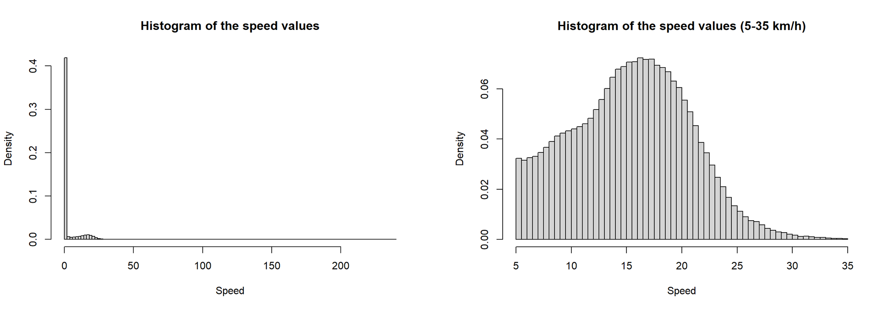
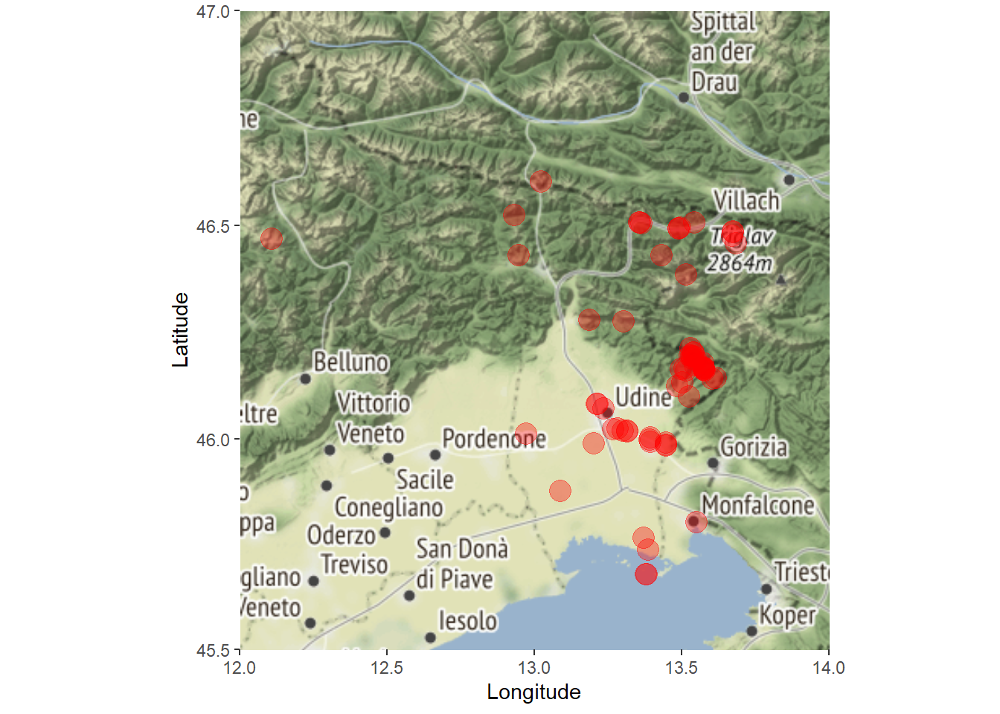
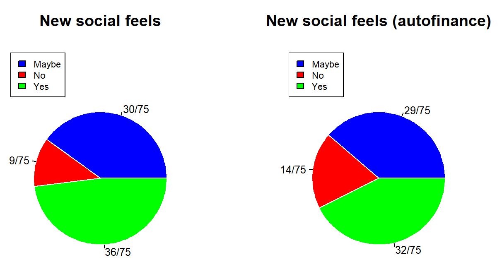

```{r setup, include=FALSE}
knitr::opts_chunk$set(cache = TRUE, message = FALSE, warning = FALSE)
```

## Travel {data-background="./objects/images/presentation/source/world_map_background.png" data-background-size="cover"}

*To go from one place to another at a distance.*

*To move to a distant or unfamiliar place.*

*To go from one place to another within a region.*

*To go or to move from place to place.*

*Be successful away from the place of origin.*

## Travel ideas

-   Travelling entails moving from one location to another.

-   Travelling is subjective.

-   We will consider the word **travel** in a broad sense, considering any movement from one place to another, including single-day trips, outside of commonly frequented places.

## Analysis ideas

-   What can be extracted and shared between travel companions or friends?

-   Data collection, privacy, information sharing, ...

-   We will study:

    -   geographic data and the best way to elicit information from those (e.g., simple coordinates, altitude, speed, geohashes);
    -   users' opinions and toughts about the use of such data on social networks.

## Analysis roots

-   Creation of a new social network related to travel in a broad sense.

-   We will try to gather as much ideas as possible starting from different datasets.

-   We will give different ideas and use data science tools to obtain as much knowledge on the topic as possible.

## Single user GPS data {data-background="./objects/images/presentation/analysis/geohash_background.png" data-background-size="cover"}

-   Based on our personal geo-localization dataset.

-   Show a possible user's behaviour when:

    -   "exploring" a geographical area;
    -   moving trough a geographical area.

## Dataset {.build}

-   Collection of personal GNSS points, logging via the app [GPSLogger](https://github.com/mendhak/gpslogger) installed on a smartphone.

-   7 Variables: time, lat, lon, elevation, accuracy, speed.

-   more than 6 million observations over 565 days.

```{r dataset, echo=FALSE, message=FALSE, warning=FALSE}
# load libraries
library(readr)
library(dplyr)
library(tidyr)

#all the .csv files that was registered (personal dataset)
all_personal_gps_data <- list.files(path="./objects/personal_dataset/",
                                    pattern="*.csv",
                                    full.names=TRUE, recursive=FALSE)

# we go through every .csv file from the folder and save into the main df
# note: this process takes 2 minutes on the complete dataset
# (it may take less depending on the number of files that have to be parsed)
personal_gps_data <- data.frame()
for(filename in all_personal_gps_data){
  # read .csv file
  csv_file <- read_csv(filename)
  # drop unused variables
  csv_file <- csv_file[ ,c('time', 'lat', 'lon', 'elevation', 'accuracy', 'speed', 'geoidheight')]
  # save informations into the big dataframe
  personal_gps_data <- bind_rows(personal_gps_data, csv_file)
}

# if speed is NA set it to 0.0
personal_gps_data$speed[is.na(personal_gps_data$speed)] = 0.0

# get geoidheigh mean
geoidheight_mean <- personal_gps_data %>%
                      summarize(height_mean = mean(geoidheight, na.rm=TRUE))

# if geoidheight is NA set it to the mean value
personal_gps_data$geoidheight[is.na(personal_gps_data$geoidheight)] <- 45 # from the analysis

# convert the elevation to be more precise (based on geoidheight)
personal_gps_data$elevation <- personal_gps_data$elevation - personal_gps_data$geoidheight

# a function to drop the specified columns
drop_from_csv <- function(df, drop_columns){
  # drop example
  # drop <- c("provider","hdop", "vdop", "pdop","battery", "annotation")
  drop <- drop_columns
  df <- df[,!(names(df) %in% drop)]
}

# drop geoidheight variable
personal_gps_data <- drop_from_csv(personal_gps_data, c('geoidheight'))

# show the dataframe
slice_sample(personal_gps_data, n=5)
```

## First considerations

<center>

{align="center" width="70%"}

</center>

-   recorded **altitude** of each point is not precise.

    -   GPS receivers consider the earth as a perfect ellipsoid;
    -   Earth's surface is full of anomalies and changes;
    -   Earth's surface as an ellipse altitude can be "corrected" using the geoid model.

##  {.build}

<center>

{align="center" width="85%"}

</center>

-   **accuracy** is related to GNSS satellites triangulation - it can be represented as a circle around a coordinate point.

-   **precision** is related to accuracy since it refers to repeatability of the accuracy radius - how consistent the result will be overtime.

## First results

-   **Accuracy**:

    -   minimum \~3 meters;
    -   maximum (changed in the app settings) \>200 meters;
    -   average we don't exceed 10 meters in accuracy ↦ good precision.

-   **Speed**:

    -   update frequency is constant and not speed dependant - "still" or "walking" points \~3 km/h;
    -   minimum: 0 km/h
    -   maximum: 238 km/h

-   **Bearing**, **hdop**, **vdop**, **pdop**: removed (hardware limitations).

## Ideas {data-background="./objects/images/presentation/source/lightbulb_background.png" data-background-size="cover"}

-   *General analysis* of the data;

-   *Regions* and *municipalities*;

-   *Geohash* representations;

-   *Proof of concept*;

-   *Graph* representation.

## General Analysis

-   **Time** between successive observations:

    -   Median: 1 second;
    -   Min: 0 seconds;
    -   Max: \~54 hours.

<center>

{align="center" width="50%"}

</center>

##  {.build}

-   **Speed**:

    -   60% of data recorded while still;
    -   minimum: 0 km/h, maximum: 238 km/h;
    -   walking speed around 5 km/h;

<center>

{align="center" width="100%"}

</center>

##  {.build}

-   speed values of different means of transport;

| **Transportation mode** | **Min speed** | **Max Speed** |
|-------------------------|---------------|---------------|
| *Still*                 | 0             | 2             |
| *Walk*                  | 2             | 9             |
| *Run/Bike*              | 9             | 20            |
| *Car/Motorbike*         | 20            | 200           |
| *Plane*                 | 200           | \>200         |

##  {.build}

-   number of points for each mean of transport category (using min-max normalization).

```{r speed, echo=FALSE, message=FALSE, warning=FALSE}
library(ggplot2)

speed_stats <- personal_gps_data %>%
                select(speed) %>%
                mutate(mode = case_when(speed<2 ~ "still", 
                                        speed>=2 & speed<9 ~ "walk",
                                        speed>=9 & speed<20 ~ "run/bike",
                                        speed>=20 & speed<200 ~ "car/motorbike",
                                        speed>=200 ~ "plane",
                                        TRUE ~ ""))

# count the number of occurrences of different mode of transport
speed_stats_modes <- speed_stats %>% group_by(mode) %>% summarize(total = n())
#speed_stats_modes

# normalize the numbers using different kinds of normalization
speed_stats_modes <- speed_stats_modes %>% select(mode, total) %>% arrange(total) %>%
                      mutate(ratio = total/sum(total),
                             feature_scaling = total/max(total),
                             min_max = (total-min(total))/(max(total)-min(total)),
                             z_scale = (total-mean(total))/sd(total))
#speed_stats_modes

# plot min max norm
modes_graph_mm <- ggplot(speed_stats_modes, color="steelblue") +
  geom_point(mapping = aes(x=mode, y=min_max, color=mode, size = 22)) +
  coord_cartesian(ylim = c(-0.6, 1.8)) +
  scale_y_continuous(breaks=c(0, 0.5, 1)) +
  theme(legend.position="none",
        axis.text.x=element_text(angle=45, hjust=1),
        axis.title.x=element_blank(),
        axis.title.y=element_blank())
modes_graph_mm

```

## 

-   **Altitude**/Elevation measures were taken not using a precise [pressure altimeter](https://en.wikipedia.org/wiki/Altimeter#Pressure_altimeter):

    -   obvious errors present;

    -   outliers present;

    -   altitude converted from WGS84 (ellipsoidal height) to Mean Sea Level (orthometric height).

        -   maximum: 9529 m
        -   minimum: -98 m
        -   mean: 234 m

##  {.build}

<center>

{align="center" width="90%"}

</center>

##  {.build}

-   outliers were removed and we proceeded to consider just the peak values;

<center>

{align="center" width="95%"}

</center>

##  {.build}

-   common places based on altitude.

<center>

{align="center" width="85%"}

</center>

## Geolocations {.build}

If we consider just the "moving" points (above 2km/h) we are left with 1 million observations.

<center>

{align="center" width="100%"}

</center>

## Cities and Municiplaities {.build}

Consider the Friuli Venezia Giulia region and its municipalities.

<center>

{align="center" width="80%"}

</center>

##  {.build}

Count the number of visited municipalities.

<center>

{align="center" width="100%"}

</center>

##  {.build}

Total percentage of visited municipalities in FVG region is 63.7% while the visited municipalities per province can be summarized as:

| **Province** | **% of municipalities visited** |
|--------------|---------------------------------|
| *Udine*      | 81%                             |
| *Gorizia*    | 80%                             |
| *Trieste*    | 17%                             |
| *Pordenone*  | 14%                             |

## Geohashes

-   The idea of converting coordinates into particular codes.

-   Geohash is a public domain geocode system (full coverage), introduced in 2008 by G.
    Niemeyer (previous work in 1966 by G. M. Morton).

-   The encoding converts a geographic location point into a short string of letters and digits, following a hierarchical structure (based on length) which subdivides space into buckets of grid shape.

##  {.build}

-   Geohash rappresentation.

```{r all_geohashes, echo=FALSE, out.width = '100%'}
# used libraries
library(geohashTools) # library used to deal with geohashes
library(tictoc) # library used to measure the performance
library(tidyr) # manipulate tidy data
library(purrr)

# function to get all the geohash codes from a starting string
gh_fill <- function(geohashes, precision){
  # vector length control
  if(nrow(nchar(geohashes) %>% as_tibble() %>% count(value)) > 1){
    stop("Input Geohashes must all have the same precision level.")
  }
  # chars used control
  if(sum(grepl("['ailo]", geohashes)) > 0){
    stop("Invalid Geohash; Valid characters: [0123456789bcdefghjkmnpqrstuvwxyz]")
  }
  # get number of chars to work on all possibilities
  new_levels <- precision - nchar(geohashes[1])
  # the base used (base32)
  base32 <- unlist(strsplit("0123456789bcdefghjkmnpqrstuvwxyz", split = ""))
  # we need to replicate the values and get a tibble df out of it
  base32_rep <- replicate(new_levels-1, base32, FALSE)
  base32_df <- tibble(base32 = base32)
  seq <- 1
  for(rep in base32_rep){
    base32_df <- base32_df %>% mutate("base32_{seq}" := rep)
    seq <- seq + 1
  }
  # cross join list of geohashes with the replication of all 32 chars (modified)
  geo <- tibble(geo = geohashes)
  base32_df <- left_join(geo, base32_df, by=character())
  result <- cross_df(base32_df) %>% unique()
  # the result is the concatenation of all elements
  result <- result %>% unite("geohash", sep="")
  return (result$geohash)
}

# get all geohashes (focus on Udine area)
all_gh_1 <- gh_to_spdf(gh_fill("", 1L))
all_gh_2 <- gh_to_spdf(gh_fill("", 2L))
all_gh_3 <- gh_to_spdf(gh_fill(c("u", "s"), 3L))
all_gh_4 <- gh_to_spdf(gh_fill(c("u2"), 4L))
all_gh_5 <- gh_to_spdf(gh_fill(c("u21"), 5L))
all_gh_6 <- gh_to_spdf(gh_fill(c("u21q", "u21m"), 6L))

library(leaflet) # library used to plot an interactive map

# generate interactive map
all_geohash_map <- 
  leaflet() %>% addTiles() %>% 
  addPolygons(data=all_gh_1,group="gh_1",label=rownames(all_gh_1@data)) %>% groupOptions("gh_1",zoomLevels=0:3) %>% 
  addPolygons(data=all_gh_2,group="gh_2",label=rownames(all_gh_2@data)) %>% groupOptions("gh_2",zoomLevels=3:6) %>%
  addPolygons(data=all_gh_3,group="gh_3",label=rownames(all_gh_3@data)) %>% groupOptions("gh_3",zoomLevels=6:9) %>%
  addPolygons(data=all_gh_4,group="gh_4",label=rownames(all_gh_4@data)) %>% groupOptions("gh_4",zoomLevels=9:12) %>%
  addPolygons(data=all_gh_5,group="gh_5",label=rownames(all_gh_5@data)) %>% groupOptions("gh_5",zoomLevels=12:14) %>% 
  addPolygons(data=all_gh_6,group="gh_6",label=rownames(all_gh_6@data)) %>% groupOptions("gh_6",zoomLevels=14:16)

all_geohash_map
```

## 

-   "Grid of rectangles".

-   Different applications:

    -   Share personal coordinates without sharing exact location
    -   Proximity searches (e.g., databases)
    -   Interactive apps (e.g., social networks, location based services, ...)

##  {.build}

-   textual representation (`base32ghs` alphabet - digits `0` to `9`, letters `a` to `z` execpt `a`, `i`, `l`, `o`)

-   Z-order curves grid (multidimensional data to one dimension)

<center>

{width="100%"}

</center>

##  {.build}

A decoding example.

| base 32ghs | base 10 | base 2 |
|------------|---------|--------|
| u          | 26      | 11010  |
| 2          | 2       | 00010  |
| 1          | 1       | 00001  |
| w          | 28      | 11100  |
| 1          | 1       | 00001  |

<br><br>

$u21w1 \mapsto 11010\;00010\;00001\;11100\;00001$.

##  {.build}

<font size="4">

$\overset{25}{\color{teal}{1}}\enspace\overset{24}{\color{orange}{1}}\enspace\overset{23}{\color{teal}{0}}\enspace\overset{22}{\color{orange}{1}}\enspace\overset{21}{\color{teal}{0}}\enspace\overset{20}{\color{orange}{0}}\enspace\overset{19}{\color{teal}{0}}\enspace\overset{18}{\color{orange}{0}}\enspace\overset{17}{\color{teal}{1}}\enspace\overset{16}{\color{orange}{0}}\enspace\overset{15}{\color{teal}{0}}\enspace\overset{14}{\color{orange}{0}}\enspace\overset{13}{\color{teal}{0}}\enspace\overset{12}{\color{orange}{0}}\enspace\overset{11}{\color{teal}{1}}\enspace\overset{10}{\color{orange}{1}}\enspace\overset{9}{\color{teal}{1}}\enspace\overset{8}{\color{orange}{1}}\enspace\overset{7}{\color{teal}{0}}\enspace\overset{6}{\color{orange}{0}}\enspace\overset{5}{\color{teal}{0}}\enspace\overset{4}{\color{orange}{0}}\enspace\overset{3}{\color{teal}{0}}\enspace\overset{2}{\color{orange}{0}}\enspace\overset{1}{\color{teal}{1}}\enspace$

</font>

Identify $\color{orange}{latitude}$ and $\color{teal}{longitude}$ $110000011000$ for latitude, $1000100110001$ for longitude.

Proceed into subsequent subdivisions, the resulting coordinates will correspond to the centre of geohash.

e.g.,

$$1\qquad\overset{-90.000}{}\overset{0.00000}{\overset{\color{red}{0}}{\rule{2.5cm}{1.5pt}\rule{2.5cm}{1.5pt}}\overset{\color{blue}{1}}{\rule{2.5cm}{1.5pt}\rule{2.5cm}{1.5pt}}}\overset{90.00000}{}$$

$$1\qquad\overset{0.00000}{}\overset{45.00000}{\overset{\color{red}{0}}{\rule{2.5cm}{1.5pt}\rule{2.5cm}{1.5pt}}\overset{\color{blue}{1}}{\rule{2.5cm}{1.5pt}\rule{2.5cm}{1.5pt}}}\overset{90.00000}{}$$

$$0\qquad\overset{45.00000}{}\overset{67.50000}{\overset{\color{red}{0}}{\rule{2.5cm}{1.5pt}\rule{2.5cm}{1.5pt}}\overset{\color{blue}{1}}{\rule{2.5cm}{1.5pt}\rule{2.5cm}{1.5pt}}}\overset{90.00000}{}$$

##  {.build}

-   Geohash error at various levels.

```{r geohash_error, echo=FALSE, message=FALSE, warning=FALSE}
# measure the latitude and longitude errors
# function based on https://en.wikipedia.org/wiki/Haversine_formula
measure <- function(lon_a, lat_a, lon_b, lat_b) {
    radius <- 6378.137 # radius of earth (km)
    dist_lat <- (lat_b-lat_a)*pi/180
    dist_lon <- (lon_b-lon_a)*pi/180
    a <- sin((dist_lat/2))^2 +
         cos(lat_a*pi/180)*
         cos(lat_b*pi/180)*
         (sin(dist_lon/2))^2
    c <- 2 * atan2(sqrt(a), sqrt(1-a))
    d <- radius * c
    return (d) # in km
}

# gh delta elements
# the first element is the latitude (y-coordinate)
# half-width at the input precision
# the second element is the longitude (x-coordinate).
gh_delta_eq <- tibble(geohash_1 = gh_delta(1))
for(i in 2:11){
    gh_delta_eq <- gh_delta_eq %>% mutate("geohash_{i}" := gh_delta(i))
}

# we can measure the area on lat and lon
measure_len_lon <- c()
measure_len_lat <- c()
for(i in 1:ncol(gh_delta_eq)) {  # for-loop over columns
  lat_delta <- pull(gh_delta_eq[1, i])
  lon_delta <- pull(gh_delta_eq[2, i])
  measure_len_lon <- c(measure_len_lon,
                       measure(+lon_delta, 0.0, -lon_delta, 0.0))
  measure_len_lat <- c(measure_len_lat,
                       measure(0.0, +lat_delta, 0.0, -lat_delta))
}

measure_error <- tibble(level = 1:11,
                        lat = round(measure_len_lat, 7),
                        lon = round(measure_len_lon, 7))

# we check the error values
measure_error <- measure_error %>% mutate(lat_error_km = round(lat/2, 7),
                                          lon_error_km = round(lon/2, 7))
measure_error %>% select(level, lat_error_km, lon_error_km)
```

##  {.build}

-   Personal dataset geohash map.

```{r dataset_geohash_map, echo=FALSE, out.width = '100%'}
# we define a function to compute geohash values
get_geohashes_from <- function(lat, lon){
  geo <- gh_encode(lat, lon, precision = 5L) # precision used is ...
  return (geo)
}

# work with the original dataset
personal_dataset_gh <- personal_gps_data %>%
                        mutate(geohashes = get_geohashes_from(lat, lon))

# get the geohashes based on the frequency (number of points on each geohash)
geohash_frequency <- personal_dataset_gh %>% 
                      group_by(geohashes) %>%
                      count(geohashes) %>%
                      arrange(-n)
geohash_frequency <- geohash_frequency %>%
  mutate(norm = (n) / sum(geohash_frequency$n)) # compute the percentage

# color palette
bins <- c(0, 5, 25, 50, 250, 500, 5000, 15000, Inf)
pal <- colorBin("YlOrRd", domain = geohash_frequency$n, bins = bins)

# all visited geohashes as SPDF
visited_geohashes <- gh_to_spdf(geohash_frequency$geohashes)

# plot the result (frequency based)
gh_heatmap_map <- 
  leaflet() %>% addTiles() %>%
  setView(lat = 46.067, lng = 13.233, zoom = 9) %>% 
  addPolygons(data = visited_geohashes,
              label = paste(rownames(visited_geohashes@data),
                            round(geohash_frequency$norm*100, 2), sep=" - "),
              fillColor = pal(geohash_frequency$n),
              fillOpacity = 0.7,
              opacity = 1, color = "white", dashArray = "3",
              stroke = TRUE, weight = 1)
gh_heatmap_map
```

## Proof of Concept

-   Geohash as a bounding box (fixed position) that contains points.

-   Geohash can give a degree of anonymity, depending on the length (level).

-   Developers' responsibility (e.g., do not send location but rather the hash code, use of appropriate length, privacy).

## 

-   Generate data given the visited geohashes on a given date.

-   Give a value to a geohash on each date in time (everyday).

-   What makes "valuable" a geohash?

    -   number of geohash points during a day;

    -   total number of points recorded during a day

    -   previous' day value (get to a "weighted" value for the next day);

    -   number of people present in the geohash;

    -   number of people using the platform (at least one geohash in a day).

## 

-   The logic can be summarized as: *enhance the discovery* of a place i.e., a geohash has more value if:

    -   it is not much visited:
        -   more value to the places that are to be "discovered" yet;
        -   lower the reward if the place "visited" is mainstream.
    -   the previous' day value is high the next day's value will be low (and vice-versa).
    -   if a lot of people visits a geohash its value will be lower (and vice-versa).

## 

-   Other interesting variables, that however we will not touch could be:

    -   total people using the app / tool;
    -   total number of Points of Interest (POI) in every geohash;
    -   street percentage (answering to: "is it just a geohash passageway?");
    -   time (in minutes for example) spend on a specific geohash;
    -   speed, altitude, bearing, ... a lot of elements could be taken into account.

## 

-   Use of the block chain technology to save in a distributed manner the geohash values overtime.

-   The idea is to use geohash explorations as a way to generate value to auto-finance their activities, discoveries, trips, travels, maintaining a registry of their travel adventures.

-   Simulation on personal dataset (1 person) showed a potential of \~5.32 "points" per day.

-   Some critical problems to overcome.

-   Possible field of research.

## Graphs

-   We can see if there is a temporal relation between visited geohashes.

-   Graph structure:

    -   level 5 geohashes as nodes;

    -   we draw a node if two geohashes are in a temporal sequence.

-   99.9% or the times there are self loops.

##  {.build}

<center>

{width="70%"}

</center>

-   Interesting patterns:
    -   lasso shapes;
    -   same round trip way;
    -   other shapes (?)

##  {.build}

<center>

{width="70%"}

</center>

-   Interesting patterns:
    -   loops or round trip;
    -   not every geohash is connected with near nodes;
    -   betweenness and page rank as an indication of the exploration network.

## Bigger dataset analysis {data-background="./objects/images/presentation/source/plane_background.png" data-background-size="cover"}

-   We could extend the same ideas as before to a bigger dataset.
-   Combine different existing datasets: [Cabspotting](http://cabspotting.org), [T-Drive](https://www.microsoft.com/en-us/research/publication/t-drive-trajectory-data-sample/), [Brightkite](https://snap.stanford.edu/data/loc-brightkite.html), [Gowalla](https://snap.stanford.edu/data/loc-gowalla.html), other.
-   Geohash representation (problems and potential).

##  {.build}

-   Worldwide geohash representation.

```{r big_dataset_gh_map, echo=FALSE, out.width = '100%'}
# load Cabspotting
cubspotting <- read_csv("./objects/extra_datasets/polished/cabspotting.csv")

# load T-Drive
tdrive <- read_csv("./objects/extra_datasets/polished/tdrive.csv")

# load Brigtkite
brightkite <- read_csv("./objects/extra_datasets/polished/brightkite.csv")

# load Gowalla
gowalla <- read_csv("./objects/extra_datasets/polished/gowalla.csv")

# load Whatch Data
watch_data <- read_csv("./objects/extra_datasets/polished/watch_data.csv")

# personal data (from the already in the environment personal_gps_data)
personal <- personal_gps_data %>% select(lat, lon)

# combine the datasets together
external_dataset <- bind_rows(list(cubspotting, tdrive, brightkite, gowalla, personal))

# drop problematic observations
external_dataset <- external_dataset %>%
  filter(between(lat, -90, 89.999), between(lon, -180, 179.999))

# compute the geohashes for each point (use level 3 here to avoid lag)
external_dataset <- external_dataset %>% mutate(geohash = gh_encode(lat, lon, 3L))

# get the geohashes based on the frequency (number of points on each geohash)
full_dataset_gh_freq <- external_dataset %>% 
                          group_by(geohash) %>%
                          count(geohash) %>%
                          arrange(-n)
full_dataset_gh_freq <- full_dataset_gh_freq %>% mutate(norm = n/sum(full_dataset_gh_freq$n))

# color palette
bins <- c(0, 5, 25, 50, 250, 500, 5000, 50000, Inf)
pal <- colorBin("YlOrRd", domain = full_dataset_gh_freq$n, bins = bins)

# geohashes as SPDF
visited_geohashes <- gh_to_spdf(full_dataset_gh_freq$geohash)

# plot all the geohashes in leaflet
gh_full_heatmap_map <- 
  leaflet() %>% addTiles() %>%
  setView(lat = 0.0, lng = 0.0, zoom = 5) %>% 
  addPolygons(data = visited_geohashes,
              label = paste(rownames(visited_geohashes@data), round(full_dataset_gh_freq$norm*100, 2), sep=" - "),
              fillColor = pal(full_dataset_gh_freq$n),
              fillOpacity = 0.7,
              opacity = 1, color = "white", dashArray = "3",
              stroke = TRUE, weight = 1)
gh_full_heatmap_map
```

## New social network analysis {data-background="./objects/images/presentation/source/landscape_background.png" data-background-size="cover"}

-   We started with the idea of checking on the best techniques to show geographical data.

-   We proposed a survey to some possible users of a social network related to travel in a broad sense.

-   We analysed a lot of factors, that we will going to summarize.

##  {.build}

-   Demographic composition of the 75 respondents.

<center>

{width="80%"}

</center>

##  {.build}

-   Existing social network familiarity and use.

<center>

{width="100%"}

</center>

##  {.build}

-   Feelings about a new social network related to travel.

<center>

{width="100%"}

</center>

##  {.build}

-   Feelings about new social network features.

<center>

{width="100%"}

</center>

##  {.build}

-   Possible users and their "relation" with travel.

-   Some statistics:

    -   mean number of visited countries: 8
    -   most travel with family or friends;
    -   main travel reasons: interest in different cultures, need for new experiences, need for recreation;
    -   main travel activities: relax and free time, discovery of natural heritage, cultural activities;
    -   people travel for different reasons: fun, experience, freedom, discovery, relax, culture, leisure, ...

##  {.build}

<center>

{width="90%"}

</center>

## Recap

-   Personal dataset with geographic points observations.

-   On-line datasets from other researches (possible additional studies).

-   Needs and ideas of users when considering a new social network related to travel.

##  {.build}

<br><br><br>

::: {style="text-align:center; font-size: 100%;"}
*We can relive **past moments** even through **little** pieces of **information***.
:::

<br><br><br><br><br><br><br>

::: {style="text-align:center; font-size: 150%;"}
Thank you for your attention.
:::
